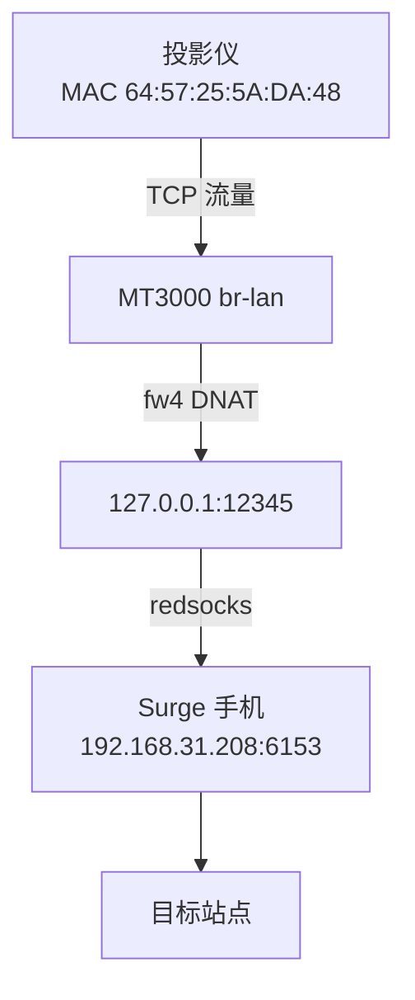

# GL-MT3000刷Openwrt作为末端无线面板接入mesh组网

> OpenWrt 旁路由 + redsocks + Surge 实现「单设备定向代理」
>
> **目标**： 在 **不改变现有有线 Mesh 网络结构** 的前提下，通过一台 **刷了OpenWrt的GL-MT3000**， 让 **指定的一台设备（投影仪）** 的流量，经由 **局域网内手机 Surge 提供的 SOCKS5 代理** 转发访问目标站点。

---

## 一、背景与原始需求（Why）

### 1. 原始网络环境

* 主路由：**小米路由器**（负责 DHCP / Mesh / 主网关）
* 网络形态：**有线 Mesh + 多 AP**
* 局域网网段：`192.168.31.0/24`
* 已有情况：

  * 局域网内 **大多数设备已可正常代理**（PC / 手机 / NAS）
  * **投影仪** 无法自行配置代理


---

### 2. 核心痛点

* ❌ 不想改动现有 Mesh 结构
* ❌ 不想让全网都走代理
* ❌ 投影仪本身 **不支持代理配置**

### 3. 解决方向

明确**约束条件**：

1. **不改主路由、不动 Mesh**
2. **只代理一台设备**（而不是一个网段）
3. **代理服务器已经存在**（手机 Surge 或者局域网内其他设备的代理）

排除：

* ❌ 改主路由透明代理
* ❌ 改 DHCP 默认网关
* ❌ 投影仪刷系统 / 装插件

最终自然收敛到：

> ✅ **软路由 / 旁路由 + 精确流量劫持**

---

## 二、方案选择与硬件落地（What）

### 1. 为什么选择旁路由方案

旁路由具备几个天然优势：

* 不破坏原网络
* 可精确控制策略
* 可随时下线、回滚
* 不影响其他设备

### 2. 硬件选择：GL-MT3000

选择 **GL-MT3000（Filogic 830）** 的原因：

* 性能充足（A53 + 硬件 NAT）
* 社区成熟
* 官方支持 OpenWrt
* 体积小、功耗低

### 3. 实际落地步骤概览

1. 购入 MT3000
2. 刷入 OpenWrt 24.x
3. 配置为 **旁路由模式**
4. 投影仪接入 MT3000 的 Wi‑Fi

---

## 三、旁路由部署中的关键经验（How - Part 1）

### 1. LAN / WAN / DHCP 的关键认知

在部署过程中，遇到过的关键坑包括：

#### ❌ 误区

* 关闭 DHCP 后误以为设备仍可自动访问
* 在 `192.168.31.x` 网络中手动给 PC 配 `192.168.1.x`
* 混淆 **WAN MAC** 与 **LAN MAC**

#### ✅ 正确认知

* WebUI 是否可访问 **取决于 IP 是否同网段**
* DHCP 关闭后，**必须手动配置 IP / 网关 / DNS**
* IP-MAC 绑定一定要确认 **接口 MAC**

---

## 四、代理实现方案的演进（How - Part 2）

### 1. 为什么选择 redsocks

redsocks 的角色非常清晰：

* 不负责分流
* 不负责规则
* **只负责把“被劫持的 TCP 流量”转成 SOCKS5**

这正好匹配：

> Surge = 代理服务器 OpenWrt = 流量入口

### 2. redsocks 最小可用配置

```conf
base {
  log_info = on;
  log_debug = off;
  daemon = on;
  redirector = iptables;
}

redsocks {
  local_ip = 127.0.0.1;
  local_port = 12345;

  ip = 192.168.31.208;   # Surge 手机 IP
  port = 6153;           # Surge SOCKS5 端口
  type = socks5;
}
```

> **关键理解**： 配置文件行数 ≠ 稳定性 redsocks 只需要描述一件事： “本地端口 → 代理服务器”

---

## 五、iptables → nftables → fw4 的真实迁移过程（How - Part 3）

### 1. 为什么 iptables 行不通

在 OpenWrt 24.x：

* iptables = **兼容层（xtables-nft）**
* REDIRECT / nat 行为受限
* kernel module 经常缺失

典型错误：

```
Warning: Extension REDIRECT revision 0 not supported
```

### 2. 手写 nftables 的风险

虽然 nft 是底层，但：

* fw4 会重新渲染规则
* 手写 table / chain 极易破坏系统防火墙

你已经亲身验证：

> ❌ 直接写 `/etc/nftables.d/*.nft` 非常容易炸防火墙

### 3. 正确答案：fw4 + UCI

> **结论**： 在 OpenWrt 24.x， **一切 NAT / REDIRECT，都应该通过 UCI firewall 完成**

---

## 六、最终正确方案（How - Part 4）

### 1. 用 UCI 声明式创建重定向规则

```bash
uci add firewall redirect
uci set firewall.@redirect[-1].name='proj_to_redsocks'
uci set firewall.@redirect[-1].src='lan'
uci set firewall.@redirect[-1].family='ipv4'
uci set firewall.@redirect[-1].proto='tcp'
uci set firewall.@redirect[-1].src_mac='64:57:25:5A:DA:48'
uci set firewall.@redirect[-1].src_dport='1-65535'
uci set firewall.@redirect[-1].dest_ip='127.0.0.1'
uci set firewall.@redirect[-1].dest_port='12345'
uci set firewall.@redirect[-1].target='DNAT'
uci commit firewall
/etc/init.d/firewall restart
```

### 2. 数据流向图（Mermaid）



---

## 七、验证与成功判据（How - Part 5）

### 1. redsocks 是否监听

```bash
netstat -lnpt | grep 12345
```

### 2. fw4 规则是否正确生成

```bash
fw4 print | grep redsocks -n
```

看到类似：

```
meta nfproto ipv4 tcp dport 1-65535 ether saddr 64:57:25:5a:da:48 dnat 127.0.0.1:12345
```

即为 **成功状态**。

---

## 八、常见问题与排错总结（Troubleshooting）

### Q1：为什么 WebUI 访问不了？

* IP 不在同一网段
* DHCP 关闭但客户端未手动配置

### Q2：iptables 明明装了却不能用？

* OpenWrt 24.x 使用 nftables
* iptables 只是兼容外壳

### Q3：nftables 语法总报错？

* fw4 会二次渲染
* 手写规则极易破坏系统

### Q4：为什么 DNAT 报 “transport protocol mapping”？

* 缺少 `proto tcp`
* fw4 需要明确 L4 协议

---

## 九、最终总结（Takeaways）

1. **旁路由是最优解**，不是折中方案
2. **redsocks 只做一件事，反而最稳定**
3. **OpenWrt 24.x 必须拥抱 fw4 + UCI**
4. **声明式配置 > 手工命令**

> 这次不是“折腾成功”， 而是完整掌握了一条 **现代 OpenWrt 的正确工程路径**。

---

（完）
