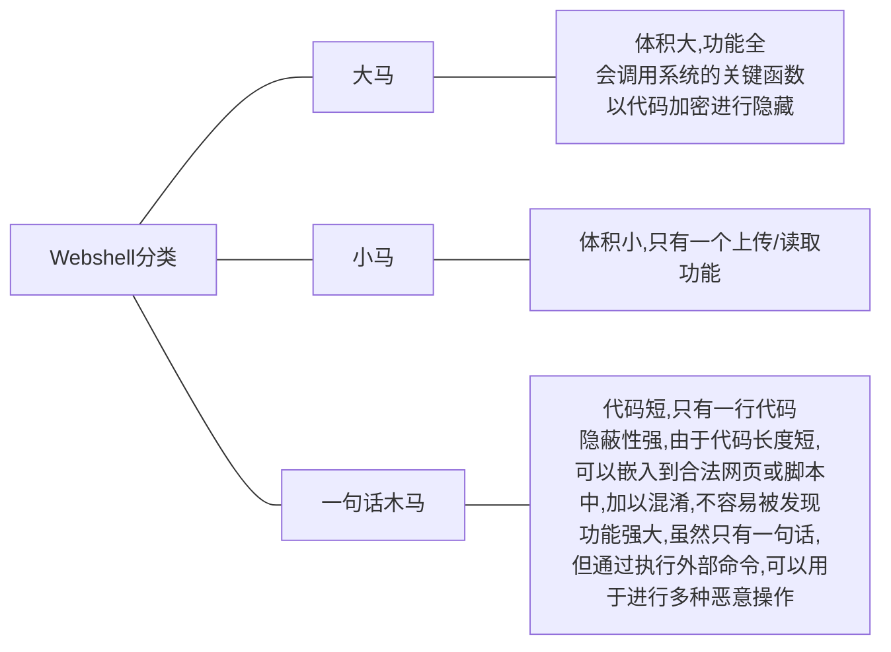
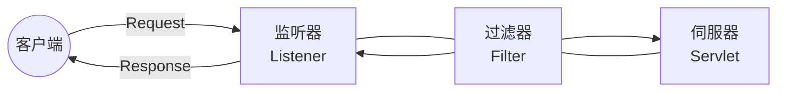

# 内存马

> [一文看懂内存马 - FreeBuf网络安全行业门户](https://www.freebuf.com/articles/web/274466.html)
>
> [Getshell/Mshell: Memshell-攻防内存马研究 (github.com)](https://github.com/Getshell/Mshell?tab=readme-ov-file)

---

- [内存马](#内存马)
  - [内存马简介](#内存马简介)
    - [WebShell变迁](#webshell变迁)
    - [如何实现Webshell内存马](#如何实现webshell内存马)
    - [内存马分类](#内存马分类)

---

## 内存马简介

### WebShell变迁

> [一文看懂内存马 - FreeBuf网络安全行业门户](https://www.freebuf.com/articles/web/274466.html)

内存马是无文件攻击的一种常用手段; 传统文件上传Webshell会落盘容易被检测到

Webshell内存马在内存中写入恶意后门和木马并执行; 黑客可以利用上传工具或网站漏洞植入木马, 区别在于Webshell内存马是无文件马, 利用中间件的进程执行某些恶意代码, 不会有文件落地

---

### 如何实现Webshell内存马

> [一文看懂内存马 - FreeBuf网络安全行业门户](https://www.freebuf.com/articles/web/274466.html)

- 目标: 访问任意URL或者指定URL, 带上命令执行参数, 即可让服务器返回命令执行结果

- 实现: 以Java为例, 客户端发起的web请求会依次经过Listener, Filter, Servlet三个组件

  我们只要在这个请求的过程中做手脚, 在内存中修改已有的组件或者动态注册一个新的组件, 插入恶意的shellcode, 就可以达到我们的目的

---

### 内存马分类

根据注入方式, 大致可以将内存马分为如下两类

- `servlet-api` 型

  通过命令执行等方式动态注册一个新的 Listener, Filter 或者 Servlet, 从而实现命令执行等功能

  特定框架, 容器的内存马原理与此类似, 如 Spring 的 controller 内存马, tomcat 的 valve 内存马

- 字节码增强型

  通过 java 的 instrumentation 动态修改已有代码, 进而实现命令执行等功能

---

