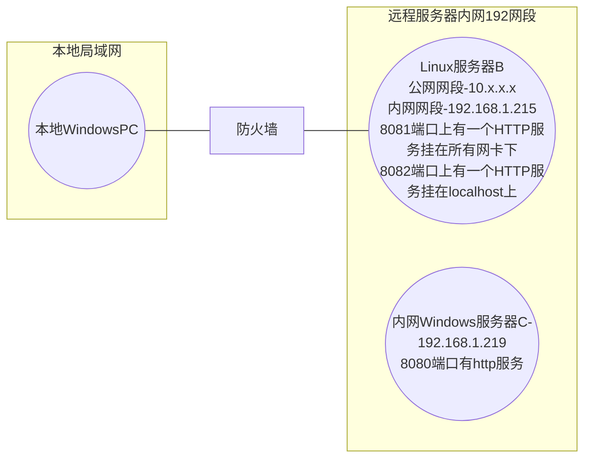
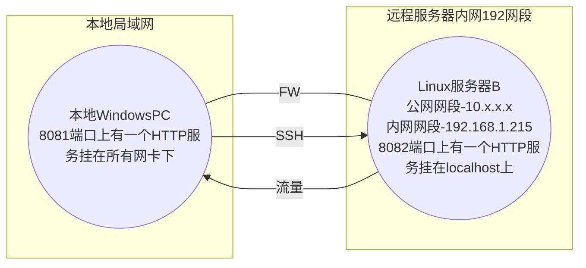

---

---

# SSH 隧道

---

- [SSH 隧道](#ssh-隧道)
  - [本地端口转发(Local Port Forwarding)](#本地端口转发local-port-forwarding)
    - [本地端口转发应用场景-访问受限服务](#本地端口转发应用场景-访问受限服务)
  - [远程端口转发(Remote Port Forwarding)](#远程端口转发remote-port-forwarding)
    - [远程端口转发应用场景-断网主机联网](#远程端口转发应用场景-断网主机联网)
  - [动态端口转发(Dynamic Port Forwarding)](#动态端口转发dynamic-port-forwarding)

---

> [什么是SSH隧道_SSH隧道介绍-华为云 (huaweicloud.com)](https://www.huaweicloud.com/zhishi/cph5.html)
>
> [SSH 隧道简明教程 - (lixueduan.com)](https://www.lixueduan.com/posts/linux/07-ssh-tunnel/)

**SSH 隧道是 SSH 中的一种机制**，它能够将其他 TCP 端口的网络数据通过 SSH 连接来转发，并且自动提供了相应的加密及解密服务。因为 SSH 为其他 TCP 链接提供了一个安全的通道来进行传输，因此这一过程也被叫做“隧道”（tunneling）。

SSH隧道即SSH端口转发，在SSH客户端与SSH服务端之间建立一个隧道，将网络数据通过该隧道转发至指定端口，从而进行网络通信。SSH隧道自动提供了相应的加密及解密服务，保证了数据传输的安全性。

SSH 隧道能够提供两大功能：

- 加密 SSH Client 端至 SSH Server 端之间的通讯数据。
- > 突破防火墙的限制完成一些之前无法建立的 TCP 连接。

SSH隧道有三种端口转发模式：

> TODO: 这里写个场景标题的汇总, 把最后一节打散放到下面具体的章节中作为示例讲解

- 本地端口转发（Local Port Forwarding）
- 远程端口转发（Remote Port Forwarding）
- 动态端口转发（Dynamic Port Forwarding）

---

## 本地端口转发(Local Port Forwarding)

对于本地/远程端口转发，两者的方向恰好相反。

本地端口转发，是将发送到本地端口的请求，转发到目标端口，这样就可以通过访问本地端口，来访问目标端口的服务。

本地端口转发可以用于

> TODO: 这里只保留标题

- **访问内网服务**: 如果当前需要访问远程网络中的服务（如数据库、Web服务），这些服务仅限于内网访问。你可以通过SSH连接到内网有公网ip的远程服务器，并使用本地端口转发将内网目标主机的端口映射到本地计算机，从而实现访问。

- **绕过防火墙或限制**: 例如一台可以 SSH 连接到的服务器的一些端口上的服务不对外开放, 可以通过本地端口转发来访问这类受限服务

  例如公司DMZ区域服务器的SSH服务对外开放, 80 端口的 HTTP 服务对内开放, 除了可以连接到内网访问此服务器的 80 端口的服务外, 还可以 SSH 此服务器建立本地端口转发来访问此服务, 从而绕过公网防火墙的防御

- **安全的Web浏览**: 当你在不安全的公共Wi-Fi网络（如咖啡厅、机场）中工作时，可以通过本地端口转发将所有Web流量通过SSH隧道加密传输到可信任的远程服务器，然后再访问互联网，从而保护隐私

  例如，通过本地端口转发将浏览器的HTTP流量通过远程的SSH服务器发送，以避免网络窃听

- **访问远程开发环境**: 开发者可以通过SSH端口转发访问远程的开发环境，比如Web应用、数据库、调试端口等，而不需要公开这些服务的端口

  例如，将远程服务器上的调试端口（如8000端口）映射到本地，从而在本地调试远程应用程序

- **远程桌面或VNC连接**: 如果远程的桌面服务（如VNC、RDP）只在内网开放，则可以通过SSH连接到远程服务器，并使用端口转发将远程桌面服务的端口映射到本地，从而访问该服务

  例如，将公司内网的VNC服务通过SSH转发到本地，以便从外部访问

总的来说, SSH本地端口转发主要用于安全、私密地访问远程服务，常用于跨越网络限制和防火墙规则

---

使用 `-L` 选项，就可以指定需要转发的端口，语法如下：

```bash
ssh -L 本地端口:目标地址:目标端口
```

```bash
# 例如
ssh -NL 9302:100.1.1.131:9303 -i "xxx" root@100.1.1.131
```

- `-f`: 表示在后台运行 ssh 命令, 不占用终端
- `-N` 表示不执行远程命令,只做端口转发
- `-i [私钥路径]` 表示使用指定私钥文件进行身份验证
- `root@100.1.1.131` 表示以 root 用户登录远程主机`100.1.1.131`


在远程主机 `100.1.1.131` 的 `9303` 端口起一个 http 服务

```bash
python -m http.server 9303
```


---

比如 VSCode Remote-SSH 连上服务器后, 在服务器上执行服务占用的端口会自动进行本地端口转发:


---

### 本地端口转发应用场景-访问受限服务

> [SSH 端口转发 - SSH 教程 - 网道 (wangdoc.com)](https://wangdoc.com/ssh/port-forwarding)

在本节开头我们有提到如下几个本地端口转发的应用场景

1. 访问内网服务
2. 绕过防火墙或限制
3. 安全的Web浏览
4. 访问远程开发环境
5. 远程桌面或VNC连接

以如下网络拓扑为例:




应用场景中 `1,2,4,5` 都属于访问受限服务的范畴

- 对于 **绕过防火墙限制** 而言, Linux服务器B的8081网卡下的服务挂在了所有网卡下, 理论上可以在本地PC上通过访问Linux公网网卡的8081端口来访问到这个HTTP服务, 但是如果公网防火墙限制了公网对Linux服务器B的8081端口的访问那么就不能如此访问了

  此时可以通过SSH本地端口转发链接到Linux服务器B将本地的某一个端口转发到Linux服务器B上任一网卡的8081端口从而达成绕过防火墙的限制访问Linux服务器B上8081端口服务的目的

- 对于 **访问远程开发环境** 而言, 这个用途最为常见, 我们在远程开发应用时可能会选择将服务挂在localhost上, 此时可以通过SSH本地端口转发来访问这些服务而不必将这些未开发完成的服务暴露在内网或公网上

- 本地PC通过SSH本地端口转发B访问C的服务

  ```bash
  ssh -L 9300:192.168.1.219:8080 root@[B公网ip]
  ```

  

  然后就可以访问本地的 9300 端口来通过 Linux 服务器 B 转发流量访问内网服务器C的8080端口上的HTTP服务了:

  

- 对于 **远程桌面或VNC连接** 而言, 原理和 **访问内网服务** 一致, 只不过把上面命令里指向的服务器C的8080端口改成了RDP3389端口或者VNC5900端口即可, 例如

  

  

  

---

上述描述的都是一层转发的场景, 如果网络拓扑存在多层隔离网络的话也可以用 SSH 本地端口转发制作多级跳板, 例如新建两个 SSH 隧道，第一个隧道转发给第二个隧道，第二个隧道才能访问目标服务器

首先，在本机新建第一级隧道

```shell
ssh -L 9300:localhost:2999 tunnel1-host
```

> 需要注意的是, 这里的 `localhost:2999` 是转发给的 `tunnel1-host` 的  `localhost:2999` 而非本地的  `localhost:2999`
>
> 例如: 
>
> 

上述命令在本地`9300`端口与`tunnel1-host`之间建立一条隧道，隧道的出口是`tunnel1-host`的`localhost:2999`，也就是`tunnel1-host`收到本机的请求以后，转发给自己的`2999`端口

然后，在第一台跳板机（`tunnel1-host`）执行下面的命令，新建第二级隧道

```shell
ssh -L 2999:target-host:7999 tunnel2-host -N
```

上述命令将第一台跳板机`tunnel1-host`的`2999`端口，通过第二台跳板机`tunnel2-host`，连接到目标服务器`target-host`的`7999`端口

最终效果就是，访问本机的`9300`端口，就会转发到`target-host`的`7999`端口

---

### 本地端口转发应用场景-安全的Web浏览

当你在不安全的公共Wi-Fi网络（如咖啡厅、机场）中工作时，可以通过本地端口转发将所有Web流量通过SSH隧道加密传输到可信任的远程服务器，然后再访问互联网，从而保护隐私

例如，通过本地端口转发将浏览器的HTTP流量通过远程的SSH服务器发送，以避免网络窃听

这个原理和上面的 **远程桌面或VNC连接** , **访问内网服务** 一致, 只不过把上面命令里指向的服务器C的8080端口改成了目标站点的目标端口

> TODO: 场景存疑, 不可信的网络具体哪里不可信

例如

```shell
ssh -L 9300:www.baidu.com:443 root@[B公网ip]
```


这里最后没打开, 不过理论上是可以访问这个端口的服务的, 可以看到请求 403 了, 应该是站点有额外的校验之类的, 这里不做继续深究

---

这里一般公开站点不会顾虑这些问题, 而且对于这些站点一般有更好的网络混淆方式

这里以我在自己的腾讯云服务器的67–端口上起的一个 HTTP 服务为例, 个人或小团队写的Web服务可能不会向大厂那样完备, 可以走 SSH 本地端口转发来加密访问此服务的流量, 例如:


---

## 远程端口转发(Remote Port Forwarding)

> TODO: 加个拓扑



与本地端口转发相对应, 远程端口转发允许你将远程服务器上的一个端口转发到本地计算机上的另一个端口

这样就可以在远程服务器上访问对应的端口以访问本地服务

远程端口转发可以用于

- **公开本地服务到互联网**:  本地计算机上运行了一个服务（例如Web服务器、数据库服务），但它无法直接暴露到外网（可能因为你所在的网络没有公共IP或防火墙限制）。通过SSH远程端口转发则可以将这个本地服务暴露给外部网络中的其他设备。

  假设你在本地开发一个Web应用，它运行在本地的 `localhost:8080`，但是你想让你的同事或客户可以通过互联网访问它。你可以使用SSH远程端口转发来实现这个目标

  ```shell
  ssh -R 80:localhost:8080 user@remote-server.com
  ```

  ```mermaid
  graph LR
      subgraph 本地局域网
          A((本地WindowsPC<br>8080端口上有一个HTTP服务挂在所有网卡下<br>localhost:8080))
      end
  
      subgraph 公网服务器
      	B((Linux服务器B<br>80))
      end
  
  
      A ---|-R 80:localhost:8080| B
      B --->|80->流量->8080| A
      A --->|SSH| B
      
  
  
  ```

  `remote-server.com` 是你可以访问的远程服务器。

  远程服务器上的80端口会将流量转发到你本地的 `localhost:8080`，使得其他人通过访问远程服务器的IP和80端口即可访问你本地的Web服务。

- **穿透NAT或防火墙**: 如果你所在的网络受到NAT或防火墙的限制，外部设备通常无法直接访问你本地的服务或设备。通过SSH远程端口转发，你可以绕过这些限制，将本地服务暴露给外部。

  例如在公司内部网络中，想从家里或外部网络访问公司内部某台设备的服务，但由于NAT或防火墙限制无法直接访问。则可以通过远程端口转发将这个服务通过外部SSH服务器暴露到互联网。

  ```shell
  ssh -R 2022:localhost:22 user@remote-server.com
  ```

  > TODO: 陪图

  将远程服务器的2022端口映射到你本地的22端口。然后，你可以从远程服务器通过`ssh -p 2022 user@remote-server.com`来访问你本地的SSH服务。

- **临时为客户端提供访问权限**: 在一些情况下，你可能想临时让客户端或其他开发人员访问你本地运行的服务，而不需要他们访问整个内部网络。通过远程端口转发，你可以安全地在短时间内提供访问权限。

  例如你在本地运行了一个测试环境的Web应用程序，客户需要验证一些功能，但你不想让他们访问整个公司的网络。你可以通过SSH远程端口转发将测试环境暴露在公共服务器上，并让客户临时访问。

  ```shell
  ssh -R 3000:localhost:3000 user@public-server.com
  ```

  这样，客户可以通过访问`public-server.com:3000`来连接到你本地的3000端口服务。

- **远程协作和调试**: 开发者在进行远程协作或调试时，可能需要访问彼此的本地开发环境，而这些环境通常在本地计算机上无法直接从外部访问。通过远程端口转发，开发者可以将他们的本地服务通过SSH隧道暴露给其他团队成员。

  例如你在本地开发了一个REST API，另一个开发者需要测试或调试这个API，但由于网络原因无法直接连接到你的本地环境。你可以通过远程端口转发将API暴露给远程服务器，以便其他开发者访问。

  ```shell
  ssh -R 5000:localhost:5000 user@remote-collab-server.com
  ```

  这样，远程的开发者可以通过访问`remote-collab-server.com:5000`来连接到你本地的API服务。

- **远程访问内部设备**

  当你在远程工作时，可能需要访问家中或公司内网中的设备，例如打印机、网络存储设备、摄像头等，但这些设备不对外开放。通过远程端口转发，你可以从外部网络访问这些内部设备。

  例如你在家里有一台NAS，但由于家中路由器的限制，外网无法直接访问这台设备。你可以通过SSH远程端口转发，在远程服务器上将NAS的Web管理端口暴露给你自己，以便在外网访问。

  ```shell
  ssh -R 8080:192.168.1.100:80 user@remote-server.com
  ```

  这个命令会将远程服务器的8080端口映射到你家里NAS的Web管理界面（例如 `192.168.1.100:80`），使得你可以通过远程服务器访问NAS。

总的来说SSH远程端口转发最主要的用途是将本地的服务或设备暴露给远程网络，常用于临时公开服务、穿透NAT或防火墙、远程协作和访问内部设备等场景。

> 换个角度考虑, 可以把本地服务器暴露给远程服务器, 那么如果远程服务器是个内网服务器的话, 可以将本地的HTTP代理暴露给远程, 远程使用此代理来达成上网的目的, 可以用于内网渗透中让内网断网主机挂DMZ联网主机的HTTP代理来实现上网

---

```bash
# 远程端口转发
ssh -R 远程端口:本地计算机地址:本地端口
```

> 转发都是源端口`port` + 目的地址 `ip:port` 的形式
>
> ```bash
> # 本地端口转发
> ssh -L 本地端口:远程计算机地址:远程端口
> ```

---

例如在本地的 9302 端口起个 SimpeHTTPServer, 然后转发远程 `100.1.1.131` 机器的 `9303` 端口到本地 `127.0.0.1:9302` 

```bash
ssh -R 9303:127.0.0.1:9302 root@100.1.1.131
```

> PS: 这里的 `127.0.0.1` 也可以是本地任意一张网卡的 ip 地址, 因为后面我们起的 SimpleHTTPServer 默认挂在 `0.0.0.0` 上的, 所以任意网卡地址都可以访问


```bash
# 本地 9302 端口起 SimpleHTTP 服务
python -m http.server 9302
```


---

然后就可以在远程机器访问其 **本地回环地址** 的 `9303` 端口来访问到本地的 `9302` 端口上的


> 相应的如果前面端口转发转发到本地其他网卡上的 `9302` 端口, 那么在远程主机上访问 `9303` 端口时, 本地 log 上看到的是对应网卡上的请求
>
> 

---

### 远程端口转发应用场景-断网主机联网

本地机器可以上网, 内网远程主机无法上网, 可以通过转发远程端口到本地 HTTP 代理服务器挂载的地址来实现远程主机通过远程端口访问本地HTTP代理上网

例如本地 `7890` 端口存在一个使用 Clash 起的 HTTP 代理服务, 则可以使用如下命令

```bash
ssh -fNR 7890:localhost:7890 -i [ssh私钥绝对路径] [用户名]@[服务器IP]
```

- `-f` 后台运行
- `-N` 不执行远程命令, 仅做端口转发
- `-R` 远程端口转发

如此一来就可以在服务器上使用本地的 Clash 代理了

- `http代理`: `http://localhost:7890`
- `socks5代理`: `socks5://localhost:7890`

在打内网时可以由此实现断网主机联网的效果

---

## 动态端口转发(Dynamic Port Forwarding)

动态端口转发允许你通过SSH创建一个SOCKS代理，从而动态地将流量转发到多个不同的目标地址和端口。

```bash
ssh -fND localhost:12345 -i [私钥路径] root@192.168.1.96
```

- `-f` 表示在后台运行 ssh 命令, 不占用终端

- `-N` 表示不执行远程命令,只做端口转发

- `-D localhost:12345` 表示创建一个动态端口转发, 将本地主机的 12345 端口作为 socks 代理

  > 这里是可以指定本地任一 IP 地址的, 也可以是 `0.0.0.0` 绑定本地任意 IP 地址

- `-i [私钥路径]` 表示使用指定私钥文件进行身份验证

- `root@192.168.1.96` 表示以 root 用户登录远程主机 192.168.1.96

这个命令可以使得通过 ssh 隧道访问远程主机上的网络服务, 或者使用远程主机作为代理访问其他网站


挂上后命令行会卡在这里 然后 Firefox 配置 socks 5 代理


如此这般就可以从本地的 Firefox 挂 96 的代理访问内网其他的服务了

除此以外还可以再套一层 Burpsuit: `BurpSuit -> Proxy Setting -> Network->Connections->Socks proxy`


配置 BurpSuit http 代理监听:


配置 Firefox http 代理


---

## SSH隧道在渗透场景中的应用

- **SSH本身** 

  - **远控**: 在拿下远程主机的shell(反弹Shell/WebShell/…)后可以转向上线C2或者走正常流程链接到远程主机, 例如 RDP/VNC/SSH, 可以选择添加用户或者密钥来使用 SSH 连接到远程主机

  - **持久化后门**: 攻击者可以部署SSH后门, 在目标系统商安装恶意SSH服务或配置来允许攻击者在未来无需重新利用漏洞就可以通过 SSH 随时访问该系统

    例如 SSH密钥,修改SSH配置,替换为恶意的SSHServer, 反向SSH

- **SSH Tunnel**

  - **绕过防火墙限制**:

    - **隐蔽流量**: 攻击者可以通过 SSH 隧道将所有流量加密后传输，从而绕过目标网络的防火墙、入侵检测系统 (IDS) 和入侵防御系统 (IPS)，避免流量被监控或过滤

      例如拿下 DMZ 区域服务器后建立动态端口转发, 然后主机挂本地的 socks 代理来做内网横向, 这样可以绕过 DMZ 区域与外网间的防火墙的防护

    - **突破出口限制**: 在某些受限的环境中，防火墙可能只允许特定的端口（如 22 端口）与外部服务器通信。此时，攻击者可以通过 SSH 隧道在 22 端口上传递其他协议的流量，突破出口的网络限制

      例如将内网数据库服务的端口转发出来, 在本地使用数据库管理工具来便捷地操作内网数据库

  - **横向渗透**: 攻击者在获得对目标主机的控制权后，可以通过 SSH 隧道进一步访问目标网络中的其他内部主机和服务; 同时, 如上文提到的那样, 这样操作顺便可以绕过边界防火墙的防护

  - **反向Shell**:

    - 例如拿下了 DMZ 主机的Webshell, 但是SSH不出网, 那么可以在DMZ主机上连接攻击侧的SSH服务做远程端口转发将本地的22端口转发出来, 攻击侧通过转发端口来连接 DMZ 的 SSH服务
    - 做横向时, 内网主机无法直接与外网攻击机通信, 可以通过 DMZ 区域主机做跳板来将目标主机的 22 端口转发出来

  - **数据渗透**: 攻击者可以使用 SSH 隧道来窃取数据，将目标系统中的敏感数据通过加密的 SSH 隧道传输回攻击者的控制系统。

    攻击者直接SSH目标主机会在连接记录上留下明显的攻击IP, 此时可以通过在目标主机上做远程端口转发连接攻击机绑定目标主机的22端口, 这样SSH登录日志里记录的只有目标主机自己的ip

    例如:

    

    

    可以看到登录ip已经是 `127.0.0.1` 了

  - **隐蔽命令与控制通信 (C2 Communication)**

    SSH 隧道可以用于命令与控制 (C2) 基础设施的通信，通过加密流量隐藏攻击者的活动。这样可以减少被检测的可能性。

    

    
